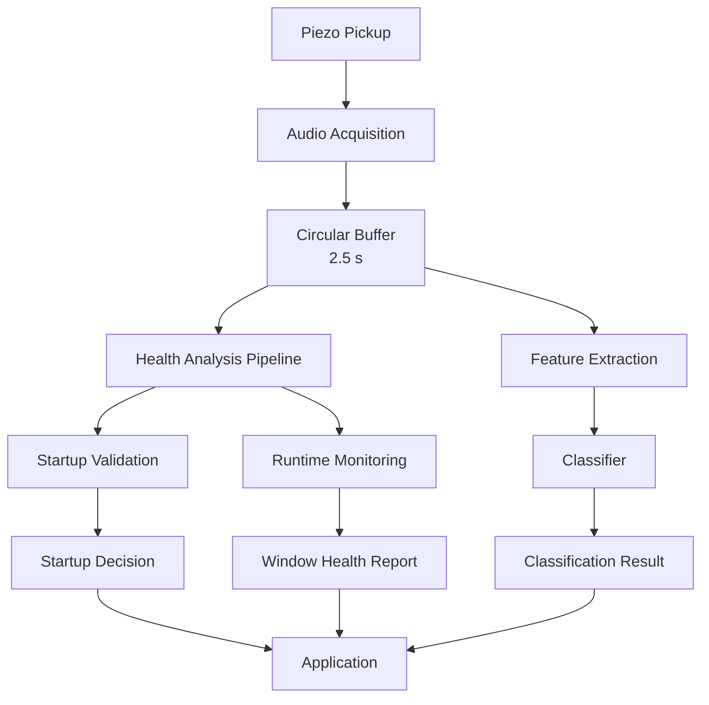
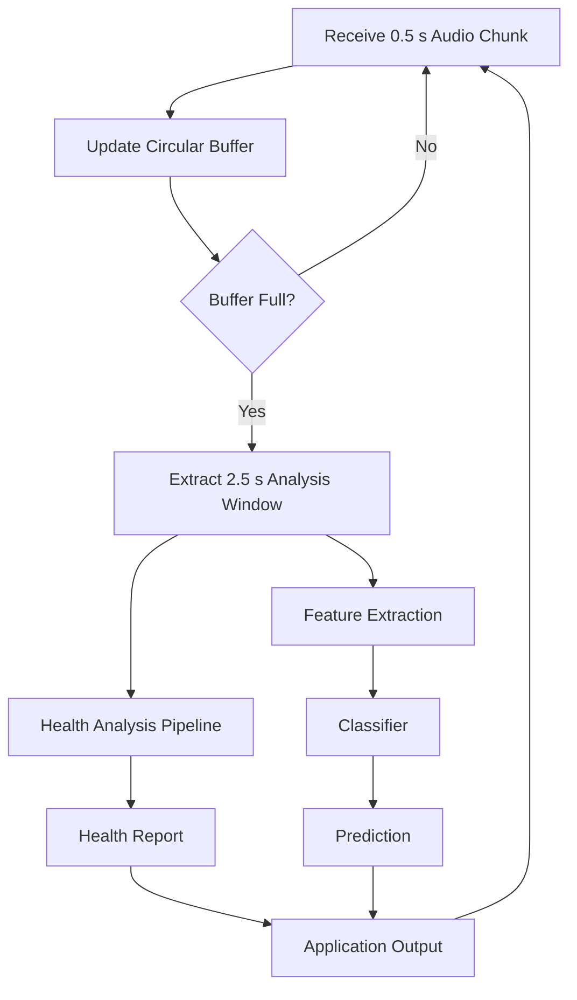
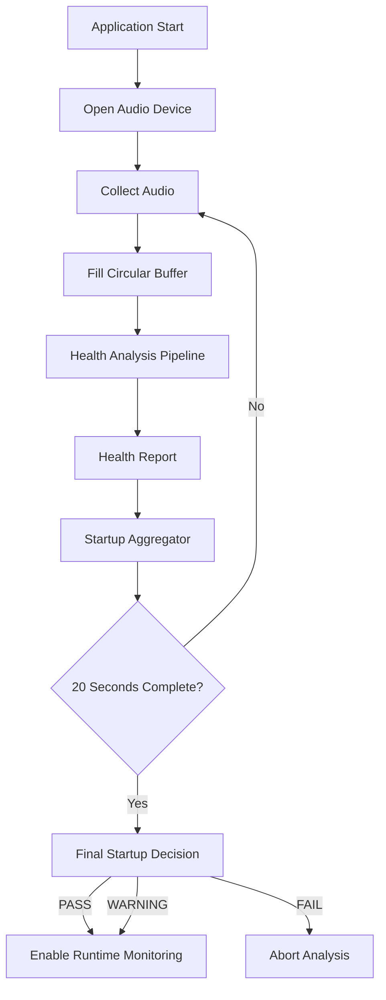
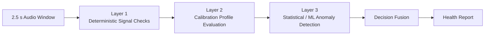
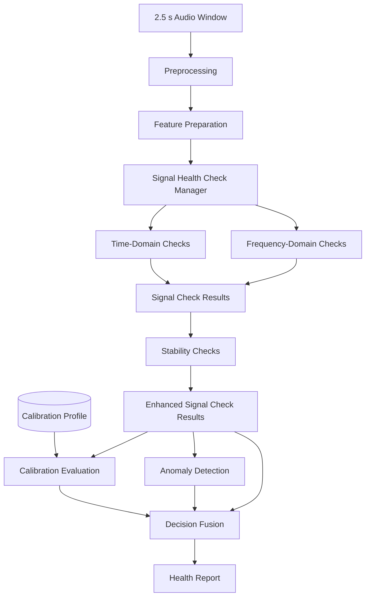
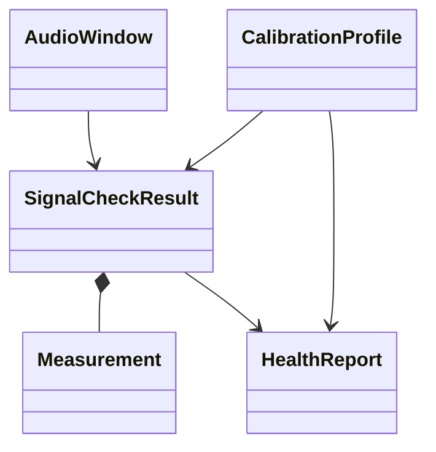
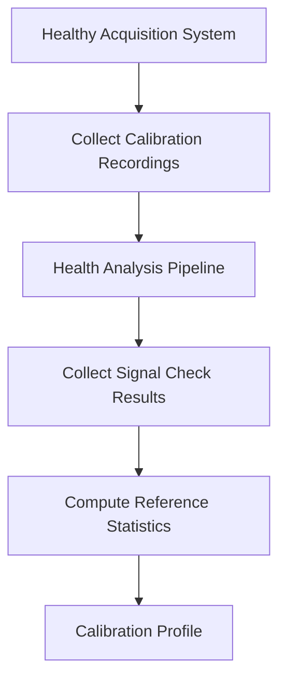
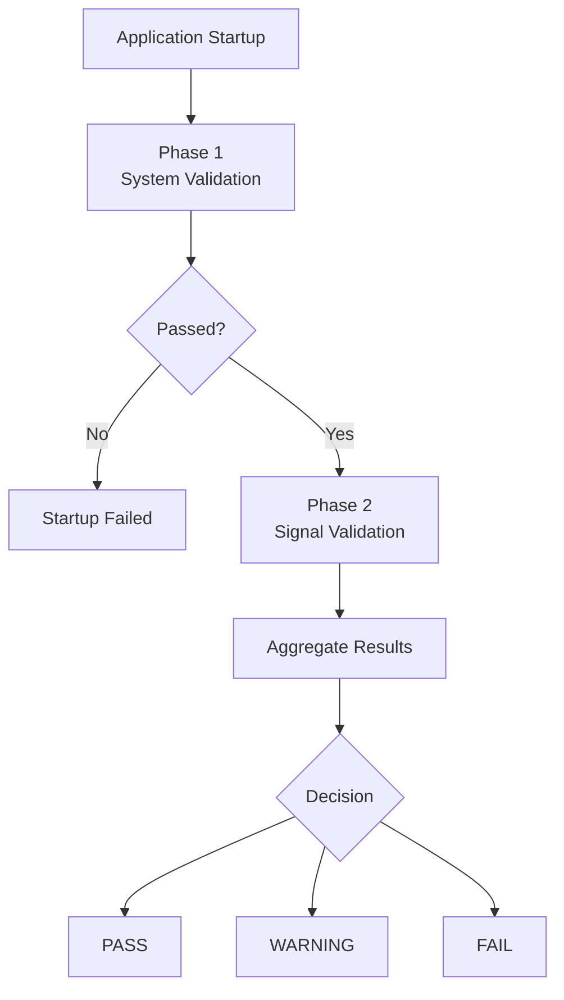
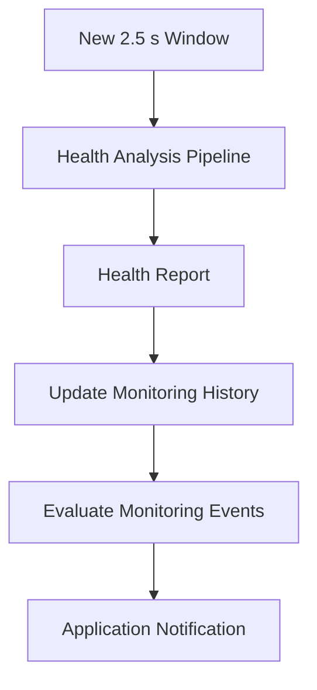
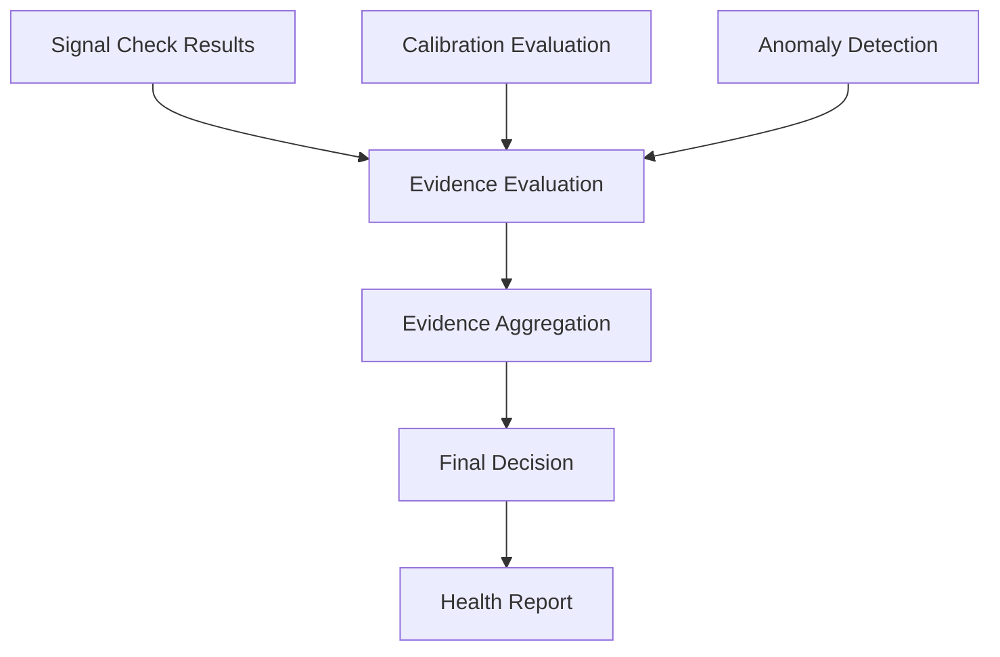

# Audio Signal Health Monitoring

## **1. Introduction**

### **1.1 Purpose**

The **Audio Signal Health Monitoring** subsystem is responsible for continuously evaluating the quality, integrity, and reliability of the incoming audio signal before and during acoustic analysis.

The subsystem operates independently of the audio classification model and determines whether the captured signal is suitable for further processing. Its primary objective is to prevent invalid or degraded audio from reaching the ML classifier, thereby increasing the reliability and robustness of the entire Palmear processing pipeline.

Unlike traditional audio quality assessment, which focuses on perceptual quality for human listeners, this subsystem evaluates whether the acquired signal is consistent with the expected behaviour of a calibrated sensing system. In Palmear, the sensing system consists of a piezoelectric pickup, its mechanical housing, the connecting cable, the audio interface, and the complete acquisition chain.

The monitoring system is designed to detect both catastrophic failures (e.g., disconnected sensor or broken cable) and more subtle degradations (e.g., excessive electrical noise, sensor drift, unstable connections, abnormal frequency response, or incorrect acquisition settings).

The subsystem does **not** classify biological events or replace the CNN classifier. Instead, it acts as a quality assurance layer that determines whether the incoming signal can be trusted before any prediction is produced.

### **1.2 Scope**

This document specifies the architecture and design of the Audio Signal Health Monitoring subsystem integrated within the Palmear audio processing framework.

The subsystem performs four primary functions:

1. **Validate the complete acquisition chain before runtime analysis begins.**
2. **Continuously monitor the health of the incoming audio stream during operation.**
3. **Detect signal abnormalities that may reduce the reliability of the CNN classifier.**
4. **Generate a health assessment together with diagnostic information for every analysed audio window.**

The subsystem is intentionally independent of the machine learning model. It analyses only the quality and integrity of the captured signal and does not perform acoustic event classification.

### **1.3 Existing Palmear Audio Processing Pipeline**

The Audio Signal Health Monitoring subsystem is designed to integrate directly into the existing Palmear processing pipeline without modifying the ML classifier or its feature extraction process.

The current Palmear acquisition pipeline operates using the following fixed configuration:

| **Parameter**        | **Value**             |
| -------------------- | --------------------- |
| Sampling rate        | **44.1 kHz**          |
| Channels             | **Mono**              |
| Incoming chunk size  | **0.5 seconds**       |
| Circular buffer size | **2.5 seconds**       |
| ML analysis window   | **2.5 seconds**       |
| Analysis interval    | **Every 0.5 seconds** |

Incoming audio is continuously received from the acquisition device in **0.5 second chunks**.

Each new chunk is appended to a circular buffer that always stores the most recent **2.5 seconds** of audio.

Once the circular buffer has been filled for the first time, the complete analysis pipeline is executed every time a new audio chunk arrives. Each execution extracts the full **2.5 second analysis window**, which is simultaneously used by:

- the Audio Signal Health Monitoring subsystem,
- the feature extraction pipeline,
- the ML classifier.

Since a new analysis window is generated every **0.5 seconds**, consecutive windows overlap by **2.0 seconds (80%)**, providing continuous monitoring while preserving the temporal context expected by the ML model.

The Audio Signal Health Monitoring subsystem is designed around this existing processing pipeline and analyses exactly the same audio windows that are passed to the CNN classifier.

### **1.4 Design Goals**

The subsystem has been designed according to the following engineering goals.

#### **G1. Detect Hardware Failures**

The system shall detect obvious hardware failures before unreliable audio reaches the CNN classifier.

Typical failures include:

- disconnected microphone or sensor
- broken or intermittent cable
- loose connector
- saturated analogue-to-digital converter (ADC)
- incorrect gain configuration
- excessive DC offset

#### **G2. Detect Signal Degradation**

The system shall detect gradual degradation of the acquisition chain that may not immediately prevent operation but can significantly reduce classification accuracy.

Examples include:

- increasing electrical noise
- abnormal frequency response
- sensor drift
- unstable signal dynamics
- persistent electrical interference
- degradation of the piezo pickup or its mechanical mounting

#### **G3. Minimise False Alarms**

Transient disturbances should not immediately produce fault conditions.

The subsystem should distinguish between temporary disturbances and persistent abnormalities by analysing the signal over multiple consecutive analysis windows before reporting a warning or fault.

#### **G4. Operate in Real Time**

The subsystem shall execute alongside the existing Palmear processing pipeline without introducing significant computational overhead.

Signal health evaluation should be completed before the corresponding CNN prediction is returned to the application.

#### **G5. Remain Independent of the ML model**

The signal health evaluation shall remain completely independent of the ML model architecture and its feature extraction process.

Future improvements or replacement of the classification model should not require modification of the health monitoring subsystem.

Similarly, improvements to the health monitoring subsystem should not require retraining or modification of the ML model.

#### **G6. Produce Explainable Results**

Every health assessment shall be accompanied by a clear explanation describing the detected abnormality.

Rather than reporting only a generic failure, the subsystem should provide meaningful diagnostic information such as:

- Flatline signal detected
- Signal clipping detected
- Excessive electrical hum
- RMS energy below calibrated range
- Abnormal spectral profile
- Excessive DC offset
- Calibration profile mismatch

These diagnostic messages shall be available for logging, debugging, and presentation to the user.

#### **G7. Support Statistical Decision Making**

Signal quality should not be determined from a single analysis window whenever possible.

Instead, the subsystem should support aggregation of multiple consecutive health assessments to improve robustness and reduce false positives.

This principle is particularly important during system startup, where multiple consecutive analysis windows are evaluated before determining whether the acquisition system is healthy enough to begin runtime operation.

### **1.5 Design Principles**

The Audio Signal Health Monitoring subsystem is designed according to the following principles:

- **Modularity** – Signal health monitoring is implemented independently of the CNN classifier and feature extraction pipeline.
- **Reusability** – The same health analysis pipeline is used during both startup validation and runtime monitoring.
- **Extensibility** – New signal quality checks and anomaly detection algorithms can be added without modifying the overall architecture.
- **Explainability** – Every warning or fault should be traceable to one or more well-defined signal quality checks.
- **Statistical Robustness** – Important decisions should be based on the aggregation of multiple observations rather than a single analysis window whenever practical.

These principles provide a flexible architecture that can evolve alongside future versions of the Palmear platform while maintaining compatibility with existing machine learning models.

## **2. System Architecture**

This section describes the overall architecture of the Audio Signal Health Monitoring subsystem and its integration with the existing Palmear processing pipeline.

The subsystem has been designed around a single principle:

**There shall be only one signal health analysis pipeline.**

The same analysis pipeline is used during both **Startup Validation** and **Runtime Monitoring**, ensuring that the exact same signal quality evaluation is performed throughout the lifetime of the application. This eliminates duplicated logic, guarantees consistent behaviour, and simplifies future maintenance.

The architecture is composed of three major processing pipelines:

1. **Audio Acquisition Pipeline**
2. **Startup Validation Pipeline**
3. **Runtime Monitoring Pipeline**

The following sections describe each pipeline and their interactions.

### **2.1 Overall Architecture**

The Audio Signal Health Monitoring subsystem operates alongside the existing Palmear ML pipeline without modifying the classifier or its feature extraction process.

Incoming audio is continuously acquired and stored in a circular buffer. Every time a new audio chunk is received, the buffer is updated and a new analysis window is generated once sufficient audio has been collected.

Both the ML classifier and the Audio Signal Health Monitoring subsystem analyse the **same 2.5 second audio window**.

The overall architecture is illustrated below.



The architecture intentionally separates **signal quality assessment** from **acoustic event classification**.

The ML model is responsible only for classifying the acoustic event, while the Health Analysis pipeline determines whether the analysed signal is reliable enough for the classification result to be trusted.

### **2.2 Processing Pipeline**

The Palmear acquisition pipeline operates using a fixed sampling configuration.

| **Parameter**     | **Value**         |
| ----------------- | ----------------- |
| Sample rate       | 44.1 kHz          |
| Channels          | Mono              |
| Incoming chunk    | 0.5 seconds       |
| Circular buffer   | 2.5 seconds       |
| Analysis window   | 2.5 seconds       |
| Analysis interval | Every 0.5 seconds |

Incoming audio is continuously received from the acquisition device in **0.5 second chunks**.

Each new chunk is appended to a circular buffer containing the most recent **2.5 seconds** of audio.

After the first five chunks have been collected, the circular buffer becomes full.

From this point onward, every newly received chunk produces a new **2.5 second analysis window**.

Since each new window overlaps the previous window by **2.0 seconds (80%)**, the system performs continuous monitoring while preserving the temporal context required by the CNN classifier.

The same analysis window is simultaneously provided to:

- the Health Analysis pipeline,
- the Feature Extraction module,
- the classifier.

This guarantees that every health assessment corresponds exactly to the audio used for classification.

The runtime processing pipeline is illustrated below.



### **2.3 Health Analysis Pipeline**

The Health Analysis Pipeline is the core component of the subsystem.

It is responsible for evaluating the quality and integrity of a single **2.5 second analysis window** and producing a complete health assessment.

The pipeline is intentionally designed to be independent of both the Startup Validation process and the Runtime Monitoring process.

Its only responsibility is:

Analyse one audio window and produce one health report.

This allows the same implementation to be reused throughout the system.

For every analysis window, the pipeline performs:

- signal quality measurements,
- calibration profile evaluation,
- anomaly detection,
- decision fusion,
- diagnostic generation.

The output of the pipeline is a **Health Report**, which contains:

- overall health status,
- individual test results,
- confidence measures,
- diagnostic messages,
- suggested severity level.

Neither the Startup Validation process nor the Runtime Monitoring process performs any signal analysis directly. Instead, both rely exclusively on the Health Analysis Pipeline.

### **2.4 Startup Validation**

Startup Validation is executed once immediately after the application starts.

Its purpose is to determine whether the complete acquisition chain is functioning correctly before the CNN classifier is allowed to begin runtime analysis.

Unlike a simple hardware check, Startup Validation performs a statistical evaluation over multiple consecutive analysis windows.

The validation procedure operates as follows:

1. Open and configure the audio device.
2. Begin collecting audio.
3. Fill the circular buffer.
4. Execute the Health Analysis Pipeline every time a new 0.5 second chunk is received.
5. Continue the validation process for **20 seconds**.
6. Aggregate the health reports produced during the validation period.
7. Produce a final startup decision.

The startup workflow is illustrated below.



The Startup Aggregator combines all health reports generated during the validation period to determine whether the acquisition system is sufficiently stable for runtime operation.

Rather than making a decision from a single analysis window, the Startup Validation process evaluates approximately **40 overlapping analysis windows**, providing a statistically robust assessment of the acquisition system.

### **2.5 Runtime Monitoring**

After successful Startup Validation, the application enters Runtime Monitoring mode.

Every incoming 0.5 second audio chunk produces a new 2.5 second analysis window.

For each window, the following operations are performed:

1. Execute the Health Analysis Pipeline.
2. Extract CNN features.
3. Execute the CNN classifier.
4. Publish both the classification result and the corresponding Health Report.

This design guarantees that every prediction generated by the CNN has a corresponding assessment of signal quality.

The Runtime Monitoring pipeline never modifies the CNN prediction. Instead, it provides additional information indicating whether the prediction should be considered trustworthy.

### **2.6 Multi-Layer Signal Health Evaluation**

The Health Analysis Pipeline performs signal evaluation using a layered architecture.

Each layer analyses the signal from a different perspective while remaining independent of the others.



The responsibilities of each layer are summarised below.

#### **Layer 1 – Deterministic Signal Checks**

The first layer detects obvious signal failures using deterministic algorithms.

Examples include:

- flatline detection
- clipping detection
- abnormal RMS
- excessive DC offset
- invalid signal dynamics

These tests are computationally inexpensive and are capable of detecting catastrophic failures immediately.

#### **Layer 2 – Calibration Profile Evaluation**

The second layer compares the analysed signal against a reference profile generated from recordings collected using a healthy acquisition system.

Instead of relying on universal thresholds, the signal is evaluated relative to the expected behaviour of the calibrated sensor.

This layer detects gradual degradation and sensor-specific abnormalities.

#### **Layer 3 – Statistical or Machine Learning Anomaly Detection**

The third layer evaluates the overall feature vector extracted from the analysis window.

Rather than analysing individual signal properties, it determines whether the complete signal behaviour differs significantly from previously observed healthy operation.

This layer is intended to detect subtle abnormalities that may not be detected by deterministic thresholds or calibration ranges.

### **2.7 Decision Fusion**

Each layer of the Health Analysis Pipeline produces an independent assessment of the analysed signal.

The Decision Fusion stage combines these individual assessments into a single Health Report.

The final health state is one of:

| **State**   | **Description**                                             |
| ----------- | ----------------------------------------------------------- |
| **OK**      | Signal is healthy and suitable for analysis.                |
| **WARNING** | Minor abnormalities detected; analysis may continue.        |
| **FAULT**   | Signal is unreliable; classification should not be trusted. |
| **UNKNOWN** | Insufficient information available.                         |

The Decision Fusion stage also generates diagnostic messages describing the reasons for the assigned health status.

This allows developers and end users to understand why a signal has been classified as abnormal rather than simply reporting a generic failure.

### **2.8 Architectural Design Principles**

The architecture has been designed according to the following principles.

#### **Single Analysis Pipeline**

Only one implementation of the signal health analysis exists within the system. Startup Validation and Runtime Monitoring both reuse the same pipeline.

#### **Shared Analysis Window**

The Health Analysis Pipeline and the CNN classifier always analyse the exact same 2.5 second audio window.

#### **Separation of Responsibilities**

Signal health evaluation and acoustic event classification remain completely independent.

#### **Continuous Monitoring**

The system continuously evaluates signal quality every time a new audio chunk is received.

#### **Statistical Robustness**

Important system decisions, particularly during startup, are based on the aggregation of multiple health assessments rather than a single observation.

These principles ensure that the subsystem remains modular, maintainable, and extensible while providing reliable signal quality assessment throughout the lifetime of the Palmear application.

## **3. Health Analysis Pipeline**

The Health Analysis Pipeline is the core processing component of the Audio Signal Health Monitoring subsystem.

Its responsibility is to evaluate the quality and integrity of a single audio analysis window and produce a comprehensive assessment describing the health of the captured signal.

The pipeline is designed to be completely independent of both the Startup Validation and Runtime Monitoring processes. Both subsystems reuse the same implementation, ensuring that signal quality is evaluated consistently throughout the lifetime of the application.

The pipeline processes a single **2.5 second mono audio analysis window** and transforms it into a standardized **Health Report** through a sequence of modular processing stages.

Unlike traditional audio processing pipelines, the Health Analysis Pipeline separates **signal measurement**, **signal evaluation**, and **decision making** into independent stages. This separation improves modularity, simplifies testing, and allows individual components to evolve independently.

### **3.1 Responsibilities**

The Health Analysis Pipeline is responsible for:

- preparing the analysis window for signal evaluation,
- computing reusable signal representations,
- executing all configured Signal Health Checks,
- comparing the observed measurements against the calibrated reference profile,
- performing anomaly detection,
- combining all results into a unified health assessment,
- generating a standardized Health Report.

The pipeline is **not** responsible for:

- audio acquisition,
- audio buffering,
- microphone management,
- feature extraction for the CNN classifier,
- acoustic event classification,
- Startup Validation decisions,
- Runtime Monitoring scheduling.

These responsibilities belong to other components described in Chapter 2.

### **3.2 Inputs**

The pipeline operates on a single analysis window extracted from the circular audio buffer.

| **Parameter**      | **Value**   |
| ------------------ | ----------- |
| Audio Format       | Mono        |
| Sampling Rate      | 44.1 kHz    |
| Window Length      | 2.5 seconds |
| Samples per Window | 110,250     |

The input window shall already satisfy the acquisition configuration described in Chapter 2.

No assumptions are made regarding the acoustic content of the recording.

### **3.3 Outputs**

The Health Analysis Pipeline progressively transforms an audio analysis window into a standardized Health Report.

During processing, the pipeline produces a collection of **Signal Check Results**, each representing the measurements and observations produced by one Signal Health Check.

These results are subsequently evaluated by the Calibration Evaluation, Anomaly Detection, and Decision Fusion stages to generate the final Health Report.

The Health Report serves as the primary interface between the Health Analysis Pipeline and the remainder of the application.

### **3.4 Processing Pipeline**

The Health Analysis Pipeline consists of seven sequential processing stages.



Each stage has a single well-defined responsibility and communicates with subsequent stages through clearly defined interfaces.

### **3.5 Stage 1 – Preprocessing**

The preprocessing stage prepares the acquired audio window for further analysis.

Typical preprocessing operations include:

- input validation,
- verification of sampling parameters,
- optional DC removal,
- optional normalization for analysis,
- validation of signal length.

The preprocessing stage should not perform computations that belong to individual Signal Health Checks.

Its responsibility is limited to preparing a valid analysis window.

### **3.6 Stage 2 – Feature Preparation**

The Feature Preparation stage computes intermediate signal representations that are shared by multiple Signal Health Checks.

Computing these representations once significantly reduces redundant computation throughout the remainder of the pipeline.

Typical derived representations include:

- Fast Fourier Transform (FFT),
- power spectrum,
- frequency bins,
- basic signal statistics,
- window duration,
- sample count.

Additional shared representations may be introduced as required by future Signal Health Checks.

### **3.7 Stage 3 – Signal Health Check Manager**

The Signal Health Check Manager coordinates the execution of all configured Signal Health Checks.

Rather than embedding individual checks directly within the pipeline, every Signal Health Check is implemented as an independent module.

Signal Health Checks are organised into three categories:

- Time-Domain Signal Health Checks,
- Frequency-Domain Signal Health Checks,
- Stability Signal Health Checks.

Time-Domain and Frequency-Domain Signal Health Checks operate directly on the current analysis window.

Stability Signal Health Checks analyse the history of previously generated Signal Check Results to detect intermittent faults and gradual degradation.

The Signal Health Check Manager is responsible for:

- executing all enabled Signal Health Checks,
- collecting Signal Check Results,
- recording execution statistics,
- isolating failures of individual checks,
- returning a unified collection of Signal Check Results.

This modular architecture allows new Signal Health Checks to be added without modifying the Health Analysis Pipeline.

### **3.8 Stage 4 – Calibration Evaluation**

The Calibration Evaluation stage compares the observed Signal Check Results against a Calibration Profile generated from recordings collected using a healthy acquisition system.

Unlike deterministic Signal Health Checks, this stage evaluates whether the observed measurements remain consistent with the expected behaviour of the calibrated sensing system.

Typical comparisons include:

- expected operating ranges,
- spectral characteristics,
- energy distribution,
- long-term statistical behaviour.

The Calibration Profile is external to the Health Analysis Pipeline and is generated during the calibration procedure described in Chapter 6.

### **3.9 Stage 5 – Anomaly Detection**

The Anomaly Detection stage evaluates the complete set of Signal Check Results to determine whether the current analysis window differs significantly from previously observed healthy behaviour.

Rather than evaluating individual measurements independently, this stage analyses the overall measurement pattern.

The anomaly detection implementation is intentionally independent from the remainder of the pipeline.

Future implementations may employ statistical techniques, machine learning models, or hybrid approaches without requiring modifications to the surrounding architecture.

The anomaly detection strategy is described in Chapter 8.

### **3.10 Stage 6 – Decision Fusion**

Decision Fusion combines the outputs produced by:

- the Signal Health Checks,
- the Calibration Evaluation stage,
- the Anomaly Detection stage.

Its responsibilities include:

- evaluating the severity of detected abnormalities,
- resolving conflicting observations,
- assigning the overall health state,
- estimating confidence,
- generating diagnostic information.

Decision Fusion is the only component responsible for determining the final health state of the analysed signal.

Possible health states include:

- **OK**
- **WARNING**
- **FAULT**
- **UNKNOWN**

The decision strategy is described in Chapter 9.

### **3.11 Stage 7 – Health Report Generation**

The final processing stage converts all evaluation results into a standardized Health Report.

The Health Report contains:

- processing metadata,
- Signal Check Results,
- calibration evaluation,
- anomaly detection results,
- diagnostic messages,
- confidence estimates,
- final health state.

The report is intended to be consumed by:

- Startup Validation,
- Runtime Monitoring,
- logging,
- diagnostic tools,
- user interfaces.

No additional processing should be required after the Health Report has been generated.

### **3.12 Pipeline Design Principles**

The Health Analysis Pipeline has been designed according to the following principles.

#### **Single Responsibility**

Each processing stage performs one clearly defined task.

#### **Modularity**

Signal Health Checks are independent software components that can be developed, tested, calibrated, and maintained separately.

#### **Reusability**

The same Health Analysis Pipeline is reused during both Startup Validation and Runtime Monitoring.

#### **Extensibility**

New Signal Health Checks can be introduced through the Signal Health Check Manager without modifying the Health Analysis Pipeline.

#### **Efficiency**

Shared signal representations shall be computed once during Feature Preparation and reused by all subsequent processing stages whenever possible.

This minimizes computational overhead while maintaining modularity.

#### **Explainability**

Every warning or fault reported by the Health Analysis Pipeline shall be traceable to one or more specific Signal Check Results.

The pipeline shall never produce unexplained health decisions.

#### **Separation of Concerns**

Signal measurement, calibration, anomaly detection, decision making, and report generation are implemented as independent processing stages.

This separation improves maintainability, simplifies testing, and allows individual stages to evolve independently without affecting the remainder of the pipeline.

## 4. Signal Health Checks

The Health Analysis Pipeline evaluates the integrity of an audio analysis window by executing a collection of independent **Signal Health Checks**.

Each Signal Health Check is responsible for evaluating exactly one property of the captured signal. Examples include signal energy, clipping, DC offset, spectral characteristics, and long-term stability.

Rather than relying on a single metric, the Health Analysis Pipeline combines the results produced by multiple Signal Health Checks to obtain a robust assessment of the overall signal health.

Each check is designed as an independent software component that can be enabled, disabled, configured, tested, and maintained separately.

The complete set of Signal Health Checks forms the foundation of the Audio Signal Health Monitoring subsystem.

### **4.1 Signal Health Check Architecture**

Every Signal Health Check follows the same execution model.

For each analysis window, a Signal Health Check:

1. receives the current 2.5 second analysis window,
2. measures one or more signal properties,
3. compares the measurements against its configured thresholds,
4. produces a **Signal Check Result**, and
5. returns the result to the Health Analysis Pipeline.

Signal Health Checks do **not** communicate with one another.

Each check operates independently and is unaware of the results produced by other checks.

The final health assessment is performed later by the Decision Fusion stage.

This architecture ensures that new checks can be added without modifying existing checks or changing the overall processing pipeline.

### **4.2 Standard Structure of a Signal Health Check**

To ensure consistency throughout the subsystem, every Signal Health Check described in this specification shall follow the same structure.

Each Signal Health Check shall define:

| **Property**               | **Description**                                  |
| -------------------------- | ------------------------------------------------ |
| **Purpose**                | Why the check exists.                            |
| **Motivation**             | Why the measured property is important.          |
| **Execution**              | Startup Validation, Runtime Monitoring, or both. |
| **Input**                  | Required input data.                             |
| **Measurements**           | Values computed by the check.                    |
| **Configuration**          | Configurable parameters and thresholds.          |
| **Output**                 | Information returned by the check.               |
| **Typical Failure Causes** | Hardware or signal problems detected.            |
| **Implementation Notes**   | Additional design considerations.                |

Notice that individual checks produce **measurements**, not the final system decision.

The interpretation of these measurements is the responsibility of the Decision Fusion stage.

### **4.3 Signal Health Check Categories**

Signal Health Checks are organised into three logical categories according to the type of information they analyse.

#### **Time-Domain Checks**

Time-domain checks operate directly on the waveform.

These checks are computationally inexpensive and therefore execute first within the Health Analysis Pipeline.

They primarily detect catastrophic failures and abnormal signal levels.

Typical examples include:

- Flatline Detection
- Signal Energy
- Peak Amplitude
- Clipping Detection
- Crest Factor
- DC Offset
- Zero Crossing Rate

#### **Frequency-Domain Checks**

Frequency-domain checks evaluate the spectral characteristics of the signal.

These checks detect abnormalities that are difficult to observe directly from the waveform.

Examples include:

- Spectral Shape
- Spectral Flatness
- Band Energy Distribution
- Electrical Hum Detection

#### **Stability Checks**

Stability checks analyse how the signal evolves over time.

Unlike the previous categories, stability checks may incorporate information from previous Health Reports.

These checks detect intermittent hardware failures, unstable connections, and gradual degradation.

Examples include:

- Energy Stability
- Spectral Stability
- Long-Term Noise Floor Monitoring

### **4.4 Execution Order**

Although Signal Health Checks operate independently, they should execute in a logical sequence.

The recommended execution order is:

1. Time-Domain Checks
2. Frequency-Domain Checks
3. Stability Checks

This ordering minimises computational overhead while allowing catastrophic failures to be detected before more computationally expensive analyses are performed.

The execution order shall **not** influence the final health assessment.

Every Signal Check Result is forwarded to the Decision Fusion stage, which evaluates all results together.

### **4.5 Signal Check Registration**

Signal Health Checks are managed by the **Signal Check Manager**.

Each check shall be registered with the manager during application initialization.

The Signal Check Manager is responsible for:

- maintaining the collection of available checks,
- enabling or disabling checks according to the application configuration,
- executing enabled checks,
- collecting their results,
- recording execution statistics,
- isolating failures of individual checks.

The Health Analysis Pipeline interacts only with the Signal Check Manager and is independent of the implementation details of individual Signal Health Checks.

Consequently, adding a new Signal Health Check requires only:

1. implementing the new check,
2. registering it with the Signal Check Manager,
3. providing its configuration.

No modification of the Health Analysis Pipeline should be necessary.

### **4.6 Design Principles**

Every Signal Health Check should satisfy the following principles.

#### **Single Responsibility**

Each check evaluates one specific property of the signal.

#### **Independence**

Checks shall not depend on the outputs of other checks.

#### **Configurability**

Every check shall be individually configurable.

The application shall allow each check to be:

- enabled or disabled,
- configured independently,
- calibrated independently when applicable.

#### **Reusability**

The same Signal Health Check implementation shall be used during both Startup Validation and Runtime Monitoring.

#### **Explainability**

Every reported measurement should be traceable to a clearly defined algorithm and corresponding signal property.

No Signal Health Check should produce unexplained results.

#### **Extensibility**

New Signal Health Checks shall be introducible without modifying existing checks or the Health Analysis Pipeline.

I think this is a good place to formalize the configuration system because **every check after this section will simply reference it** rather than redefining configuration behavior.

One thing I would add is the concept of a **configuration profile**. For example:

- `development`
- `production`
- `diagnostic`
- `minimal`

This allows Palmear to enable different sets of checks without changing code.

Below is the version I would put into the design document.

### **4.7 Signal Health Check Configuration**

The Audio Signal Health Monitoring subsystem has been designed to support a configurable and extensible set of Signal Health Checks.

Not every deployment requires the same level of signal analysis. During development, additional diagnostic checks may be enabled to aid debugging, while production deployments may disable computationally expensive checks that provide limited additional value.

For this reason, every Signal Health Check shall be configurable through a centralized configuration system.

The configuration system determines:

- which Signal Health Checks are executed,
- how individual checks are configured,
- where thresholds are obtained,
- which checks are mandatory,
- how Startup Validation and Runtime Monitoring behave.

The Health Analysis Pipeline shall obtain all runtime configuration from this configuration system. Individual Signal Health Checks shall not contain hard-coded configuration values.

#### **4.7.1 Configuration Hierarchy**

Configuration is organised into four logical levels.

```text
Global Configuration
        │
        ▼
Category Configuration
        │
        ▼
Individual Check Configuration
        │
        ▼
Calibration Values
```

Each level overrides the configuration defined by the previous level.

This hierarchy allows system-wide defaults while still permitting individual checks to be configured independently.

#### **4.7.2 Global Configuration**

The global configuration controls the behaviour of the entire Audio Signal Health Monitoring subsystem.

Typical parameters include:

| **Parameter**               | **Description**                             |
| --------------------------- | ------------------------------------------- |
| Enabled                     | Enable or disable the entire subsystem.     |
| Startup Validation Duration | Duration of the startup validation period.  |
| Analysis Window Size        | Length of the audio analysis window.        |
| Analysis Interval           | Time between consecutive analyses.          |
| Sampling Rate               | Expected sampling frequency.                |
| Enable Runtime Monitoring   | Enable continuous monitoring after startup. |
| Configuration Profile       | Active configuration profile.               |

These parameters affect the behaviour of the Health Analysis Pipeline as a whole.

#### **4.7.3 Category Configuration**

Each category of Signal Health Checks may define default behaviour for all checks within that category.

Examples include:

- enabling or disabling all Time-Domain Checks,
- enabling or disabling all Frequency-Domain Checks,
- enabling or disabling all Stability Checks.

Category-level configuration reduces duplication when multiple checks share common settings.

Individual Signal Health Checks may override these defaults.

#### **4.7.4 Individual Check Configuration**

Every Signal Health Check shall define its own configuration section.

The configuration shall contain only parameters required by that specific check.

Typical parameters include:

| **Property**              | **Description**                           |
| ------------------------- | ----------------------------------------- |
| Enabled                   | Execute or skip this check.               |
| Mandatory                 | Prevent the check from being disabled.    |
| Threshold Source          | Manual or calibration-derived thresholds. |
| Warning Threshold         | Optional warning limit.                   |
| Fault Threshold           | Optional fault limit.                     |
| Check-Specific Parameters | Parameters unique to the check.           |

Checks shall not assume that every parameter is present.

Reasonable default values shall be provided where appropriate.

#### **4.7.5 Threshold Sources**

Threshold values may originate from one of two sources.

##### **Manual Thresholds**

Threshold values are explicitly defined by the application configuration.

This mode is primarily intended for:

- development,
- testing,
- laboratory evaluation,
- debugging.

##### **Calibration-Derived Thresholds**

Threshold values are obtained from the calibration profile generated using a healthy acquisition system.

Examples include:

- minimum RMS,
- maximum RMS,
- expected spectral centroid,
- acceptable energy distribution,
- expected noise floor.

Calibration-derived thresholds are the recommended operating mode for production deployments because they adapt the Health Analysis Pipeline to the characteristics of the specific sensing system.

#### **4.7.6 Mandatory Checks**

Certain Signal Health Checks may be designated as **mandatory**.

Mandatory checks cannot be disabled through configuration.

Examples include:

- Flatline Detection,
- Signal Energy,
- Clipping Detection.

Mandatory checks protect the system against catastrophic acquisition failures and should therefore always execute.

Other checks may be enabled or disabled depending on application requirements.

#### **4.7.7 Configuration Profiles**

The configuration system may define multiple named configuration profiles.

Examples include:

| **Profile** | **Purpose**                                                  |
| ----------- | ------------------------------------------------------------ |
| Development | Enable all available checks and diagnostic logging.          |
| Production  | Enable recommended checks with calibrated thresholds.        |
| Diagnostic  | Enable every check together with detailed logging and intermediate measurements. |
| Minimal     | Enable only mandatory checks for resource-constrained environments. |

Configuration profiles simplify deployment by allowing multiple predefined operating modes without modifying individual settings.

#### **4.7.8 Example Configuration Structure**

The following example illustrates the logical organisation of the configuration.

```yaml
signal_health:

  enabled: true

  profile: production

  startup:
    validation_duration: 20

  runtime:
    enabled: true

  analysis:
    sample_rate: 44100
    window_seconds: 2.5
    interval_seconds: 0.5

  categories:

    time_domain:
      enabled: true

    frequency_domain:
      enabled: true

    stability:
      enabled: true

  checks:

    flatline:
      enabled: true
      mandatory: true
      threshold_source: calibration

    signal_energy:
      enabled: true
      mandatory: true
      threshold_source: calibration

    clipping:
      enabled: true
      mandatory: true
      threshold_source: calibration

    dc_offset:
      enabled: true
      threshold_source: calibration

    electrical_hum:
      enabled: false
      threshold_source: manual
```

The exact storage format is implementation-dependent.

The example above illustrates the logical organisation of the configuration rather than a mandatory file format.

#### **4.7.9 Configuration Design Principles**

The configuration system shall satisfy the following principles.

##### **Centralized**

All configuration shall be managed through a single configuration system.

Signal Health Checks shall not contain hard-coded configuration values.

##### **Independent**

Each Signal Health Check shall be configurable independently.

Changing one check shall not affect the behaviour of other checks.

##### **Extensible**

New Signal Health Checks shall introduce only their own configuration parameters.

Existing configuration files should remain valid whenever possible.

##### **Calibration-Aware**

Whenever possible, thresholds should be obtained from the calibration profile rather than manually specified values.

This allows the Audio Signal Health Monitoring subsystem to adapt automatically to different sensors, acquisition hardware, and deployment environments.

##### **Reproducible**

The complete configuration used during Startup Validation and Runtime Monitoring shall be recorded as part of the application logs.

This ensures that Health Reports can be reproduced and analysed during debugging and system validation.

### **4.8 Time-Domain Signal Health Checks**

Time-domain Signal Health Checks operate directly on the waveform without transforming the signal into the frequency domain.

These checks are computationally inexpensive and therefore execute first within the Health Analysis Pipeline.

Their primary objectives are:

- detecting catastrophic hardware failures,
- validating signal amplitude,
- identifying abnormal waveform characteristics,
- providing fast diagnostic information before more computationally expensive analyses are performed.

Unless explicitly stated otherwise, all Time-Domain Signal Health Checks execute during both **Startup Validation** and **Runtime Monitoring**.

#### **4.8.1 Overview**

The Time-Domain Signal Health Checks implemented by the system are summarised below.

| **ID** | **Check**          | **Primary Objective**                                        |
| ------ | ------------------ | ------------------------------------------------------------ |
| T001   | Flatline Detection | Detect complete loss of signal.                              |
| T002   | Signal Energy      | Verify that sufficient signal energy is present.             |
| T003   | Peak Amplitude     | Detect unusually small or unusually large peaks.             |
| T004   | Clipping Detection | Detect ADC or amplifier saturation.                          |
| T005   | Crest Factor       | Detect abnormal waveform dynamics.                           |
| T006   | DC Offset          | Detect acquisition bias introduced by hardware.              |
| T007   | Zero Crossing Rate | Detect abnormal waveform behaviour and excessive high-frequency noise. |

Each check evaluates a different property of the signal and therefore complements the remaining checks.

##### **T001 – Flatline Detection**

###### **Purpose**

Detect complete loss of signal caused by catastrophic failures within the acquisition chain.

Typical failures include disconnected sensors, broken cables, hardware failures, or disabled recording devices.

###### **Measurements**

The check evaluates signal variability using measurements such as:

- signal standard deviation,
- minimum sample value,
- maximum sample value,
- peak-to-peak amplitude.

###### **Configuration Parameters**

| **Parameter**      | **Description**                               |
| ------------------ | --------------------------------------------- |
| `min_std`          | Minimum acceptable signal standard deviation. |
| `min_peak_to_peak` | Minimum acceptable peak-to-peak amplitude.    |

Thresholds should preferably be obtained from the calibration profile.

###### **Output**

The check produces a Signal Check Result containing:

- measured statistics,
- pass/fail evaluation,
- diagnostic information.

###### **Typical Failure Causes**

- disconnected piezo pickup,
- broken cable,
- loose connector,
- acquisition hardware failure,
- disabled recording device.

###### **Notes**

Flatline Detection should execute before all other Signal Health Checks because it detects catastrophic failures with minimal computational cost.

##### **T002 – Signal Energy**

###### **Purpose**

Determine whether the acquired signal contains sufficient energy for reliable analysis.

Unlike Flatline Detection, this check identifies signals that are present but significantly weaker or stronger than expected.

###### **Measurements**

Typical measurements include:

- RMS energy,
- average absolute amplitude,
- total signal energy.

###### **Configuration Parameters**

| **Parameter** | **Description**                   |
| ------------- | --------------------------------- |
| `min_rms`     | Minimum acceptable RMS value.     |
| `max_rms`     | Maximum acceptable RMS value.     |
| `min_energy`  | Minimum acceptable signal energy. |
| `max_energy`  | Maximum acceptable signal energy. |

###### **Output**

The check reports:

- RMS energy,
- signal energy,
- average absolute amplitude,
- diagnostic information.

###### **Typical Failure Causes**

- damaged sensor,
- partially broken cable,
- incorrect gain,
- degraded piezo sensitivity,
- poor mechanical coupling.

###### **Notes**

Signal Energy replaces the previously separate concepts of Signal Presence and RMS Energy.

##### **T003 – Peak Amplitude**

###### **Purpose**

Verify that the maximum signal amplitude remains within the expected operating range.

This check identifies signals that are either significantly weaker or stronger than expected.

###### **Measurements**

Typical measurements include:

- positive peak amplitude,
- negative peak amplitude,
- absolute peak amplitude.

###### **Configuration Parameters**

| **Parameter** | **Description**                    |
| ------------- | ---------------------------------- |
| `min_peak`    | Minimum acceptable peak amplitude. |
| `max_peak`    | Maximum acceptable peak amplitude. |

###### **Output**

The check reports:

- peak amplitude,
- maximum positive value,
- maximum negative value.

###### **Typical Failure Causes**

- excessive amplifier gain,
- weak sensor output,
- acquisition gain configuration errors.

###### **Notes**

Peak Amplitude evaluates only the largest sample values and therefore complements Signal Energy rather than replacing it.

##### **T004 – Clipping Detection**

##### **Purpose**

Detect signal saturation caused by ADC clipping or amplifier overload.

##### **Measurements**

Typical measurements include:

- clipping threshold,
- number of clipped samples,
- clipping ratio.

##### **Configuration Parameters**

| **Parameter**        | **Description**                     |
| -------------------- | ----------------------------------- |
| `clipping_threshold` | Sample value considered clipped.    |
| `warning_ratio`      | Clipping ratio producing a warning. |
| `fault_ratio`        | Clipping ratio producing a fault.   |

##### **Output**

The check reports:

- clipping ratio,
- clipped sample count,
- clipping locations.

##### **Typical Failure Causes**

- excessive gain,
- ADC saturation,
- amplifier overload,
- unexpected high-energy impacts.

##### **Notes**

Unlike Peak Amplitude, this check evaluates whether peaks have reached the acquisition limits rather than simply measuring their magnitude.

#### **T005 – Crest Factor**

##### **Purpose**

Evaluate the relationship between signal peaks and average signal energy.

##### **Measurements**

Typical measurements include:

- crest factor,
- peak amplitude,
- RMS energy.

##### **Configuration Parameters**

| **Parameter**      | **Description**                  |
| ------------------ | -------------------------------- |
| `min_crest_factor` | Minimum acceptable crest factor. |
| `max_crest_factor` | Maximum acceptable crest factor. |

##### **Output**

The check reports:

- crest factor,
- associated measurements,
- diagnostic information.

##### **Typical Failure Causes**

- abnormal impulsive noise,
- crackling connections,
- amplifier distortion,
- waveform saturation.

##### **Notes**

The Crest Factor provides additional information about waveform dynamics and complements Signal Energy and Peak Amplitude.

#### **T006 – DC Offset**

##### **Purpose**

Detect constant bias introduced by the acquisition hardware.

##### **Measurements**

Typical measurements include:

- signal mean,
- absolute DC offset.

##### **Configuration Parameters**

| **Parameter**   | **Description**                     |
| --------------- | ----------------------------------- |
| `max_dc_offset` | Maximum acceptable absolute offset. |

##### **Output**

The check reports:

- measured DC offset,
- diagnostic information.

##### **Typical Failure Causes**

- faulty audio interface,
- hardware bias,
- damaged amplifier,
- analogue circuitry faults.

##### **Notes**

DC Offset should be evaluated using the original unmodified signal.

#### **T007 – Zero Crossing Rate**

##### **Purpose**

Evaluate waveform characteristics using the frequency of signal polarity changes.

##### **Measurements**

Typical measurements include:

- zero crossing count,
- zero crossing rate.

##### **Configuration Parameters**

| **Parameter** | **Description**                        |
| ------------- | -------------------------------------- |
| `min_zcr`     | Minimum acceptable zero crossing rate. |
| `max_zcr`     | Maximum acceptable zero crossing rate. |

##### **Output**

The check reports:

- zero crossing count,
- zero crossing rate,
- diagnostic information.

##### **Typical Failure Causes**

- excessive high-frequency noise,
- electrical interference,
- abnormal waveform behaviour,
- acquisition instability.

##### **Notes**

Zero Crossing Rate is considered a complementary diagnostic measurement and should not be used as the sole indicator of signal health.

Instead, its measurements should be interpreted together with the remaining Time-Domain Signal Health Checks.

#### **4.8.2 Design Summary**

Collectively, the Time-Domain Signal Health Checks provide rapid detection of catastrophic failures, abnormal signal levels, waveform distortion, and acquisition hardware problems.

These checks form the first stage of the Health Analysis Pipeline and provide the majority of the information required to determine whether the acquired waveform is physically plausible before more computationally intensive frequency-domain analyses are performed.

### **4.9 Frequency-Domain Signal Health Checks**

Frequency-Domain Signal Health Checks evaluate the spectral characteristics of the acquired audio signal.

Unlike Time-Domain Signal Health Checks, which analyse the waveform directly, Frequency-Domain Signal Health Checks operate on frequency-domain representations derived from the analysis window.

These checks are intended to detect signal degradations that cannot be reliably observed from amplitude measurements alone.

Examples include:

- abnormal frequency response,
- electrical interference,
- excessive broadband noise,
- sensor degradation,
- mechanical mounting changes,
- cable shielding problems.

The frequency-domain representation required by these checks shall be generated once during the preprocessing stage and reused by all Frequency-Domain Signal Health Checks.

#### **4.9.1 Overview**

The Frequency-Domain Signal Health Checks implemented by the system are summarised below.

| **ID** | **Check**                | **Primary Objective**                                        |
| ------ | ------------------------ | ------------------------------------------------------------ |
| F001   | Spectral Shape           | Verify the overall frequency response.                       |
| F002   | Spectral Flatness        | Detect broadband noise and loss of spectral structure.       |
| F003   | Band Energy Distribution | Verify energy distribution across predefined frequency bands. |
| F004   | Electrical Hum Detection | Detect power-line interference and harmonics.                |

Collectively these checks determine whether the measured spectrum remains consistent with the expected behaviour of a healthy acquisition system.

##### **F001 – Spectral Shape**

###### **Purpose**

Verify that the overall spectral characteristics of the signal remain consistent with the calibrated behaviour of the sensing system.

###### **Motivation**

Many hardware problems alter the frequency response without significantly changing the signal amplitude.

Examples include:

- loose sensor mounting,
- damaged piezo element,
- cable degradation,
- analogue filter changes,
- preamplifier faults.

Spectral Shape provides a general assessment of the overall frequency response.

###### **Measurements**

Typical measurements include:

- spectral centroid,
- spectral bandwidth,
- spectral roll-off.

Additional measurements may be incorporated if required by future versions of the Health Analysis Pipeline.

###### **Configuration Parameters**

| **Parameter**     | **Description**                    |
| ----------------- | ---------------------------------- |
| `centroid_range`  | Expected centroid operating range. |
| `bandwidth_range` | Expected bandwidth range.          |
| `rolloff_range`   | Expected roll-off range.           |

Thresholds should normally be obtained from the calibration profile.

###### **Output**

The check reports:

- measured spectral centroid,
- measured spectral bandwidth,
- measured spectral roll-off,
- diagnostic information.

###### **Typical Failure Causes**

- loose housing,
- damaged sensor,
- analogue filter changes,
- degraded acquisition chain.

###### **Notes**

This check provides a high-level description of the spectral behaviour and complements the more detailed frequency-domain checks.

##### **F002 – Spectral Flatness**

###### **Purpose**

Measure how noise-like the acquired spectrum is.

###### **Motivation**

Healthy piezo recordings often exhibit clear spectral structure.

As broadband electrical noise increases or mechanical coupling deteriorates, the spectrum typically becomes flatter.

Spectral Flatness provides an effective indicator of these changes.

###### **Measurements**

Typical measurements include:

- spectral flatness,
- logarithmic flatness.

###### **Configuration Parameters**

| **Parameter**      | **Description**                       |
| ------------------ | ------------------------------------- |
| `maximum_flatness` | Maximum acceptable spectral flatness. |

###### **Output**

The check reports:

- spectral flatness,
- associated diagnostic information.

###### **Typical Failure Causes**

- broadband electrical noise,
- poor shielding,
- cable degradation,
- sensor deterioration.

###### **Notes**

Spectral Flatness should not be interpreted independently of Spectral Shape.

Both measurements together provide a more complete description of spectral behaviour.

##### **F003 – Band Energy Distribution**

###### **Purpose**

Verify that signal energy remains distributed across the frequency spectrum as expected for the calibrated sensing system.

###### **Motivation**

Different hardware failures often affect specific frequency regions rather than the entire spectrum.

Monitoring energy distribution across predefined frequency bands allows localized spectral abnormalities to be detected.

###### **Measurements**

Typical measurements include:

- low-frequency energy,
- mid-frequency energy,
- high-frequency energy,
- relative band energy ratios.

The number and location of frequency bands shall be configurable.

###### **Configuration Parameters**

| **Parameter**                  | **Description**                 |
| ------------------------------ | ------------------------------- |
| `frequency_bands`              | Definition of analysis bands.   |
| `expected_energy_distribution` | Calibrated energy distribution. |

###### **Output**

The check reports:

- energy contained within each configured frequency band,
- normalized energy ratios,
- diagnostic information.

###### **Typical Failure Causes**

- mechanical coupling changes,
- damaged housing,
- sensor ageing,
- acoustic path changes,
- hardware resonance changes.

###### **Notes**

This check is expected to be one of the most important Frequency-Domain Signal Health Checks for piezo-based sensing systems because it directly evaluates the expected frequency response of the calibrated hardware.

##### **F004 – Electrical Hum Detection**

###### **Purpose**

Detect electrical interference introduced by the acquisition system.

###### **Motivation**

Power-line interference commonly appears as narrow spectral peaks centred around the local mains frequency and its harmonics.

Such interference may significantly affect acoustic analysis despite leaving other signal characteristics unchanged.

###### **Measurements**

Typical measurements include:

- energy around the mains frequency,
- harmonic energy,
- hum-to-total-energy ratio.

The monitored frequencies shall be configurable to support different geographical regions.

###### **Configuration Parameters**

| **Parameter**           | **Description**                                 |
| ----------------------- | ----------------------------------------------- |
| `fundamental_frequency` | Expected mains frequency (e.g. 50 Hz or 60 Hz). |
| `harmonic_count`        | Number of harmonics analysed.                   |
| `analysis_bandwidth`    | Frequency tolerance around each harmonic.       |

###### **Output**

The check reports:

- detected hum energy,
- harmonic energy,
- hum ratio,
- diagnostic information.

###### **Typical Failure Causes**

- ground loops,
- poor shielding,
- faulty power supplies,
- electromagnetic interference,
- damaged cables.

###### **Notes**

Electrical Hum Detection should remain configurable because some deployment environments naturally exhibit higher electromagnetic interference than others.

#### **4.9.2 Design Summary**

The Frequency-Domain Signal Health Checks complement the Time-Domain Signal Health Checks by evaluating properties of the signal that cannot be reliably observed from waveform measurements alone.

For piezo-based sensing systems, Frequency-Domain Signal Health Checks are expected to provide the strongest indication of gradual sensor degradation, changes in mechanical coupling, and acquisition hardware problems.

When combined with calibration-based thresholds, these checks allow the Health Analysis Pipeline to detect subtle changes in sensor behaviour long before complete hardware failure occurs.

### 4.10 Stability Signal Health Checks

Unlike Time-Domain and Frequency-Domain Signal Health Checks, Stability Signal Health Checks do not evaluate the current audio analysis window directly.

Instead, they analyse the **history of previously generated Signal Check Results** to determine whether the acquisition system behaves consistently over time.

This allows the Health Analysis Pipeline to detect intermittent failures and gradual degradation that cannot be identified from a single analysis window.

Typical examples include:

- intermittent cable faults,
- loose connectors,
- unstable power supplies,
- increasing background noise,
- gradual sensor degradation.

The Stability Signal Health Checks operate after all Time-Domain and Frequency-Domain Signal Health Checks have completed.

#### **4.10.1 Overview**

The Stability Signal Health Checks implemented by the system are summarised below.

| **ID** | **Check**             | **Primary Objective**                                    |
| ------ | --------------------- | -------------------------------------------------------- |
| S001   | Energy Stability      | Monitor the stability of signal energy over time.        |
| S002   | Spectral Stability    | Monitor long-term stability of spectral characteristics. |
| S003   | Long-Term Noise Floor | Detect gradual increases in background noise.            |

Unlike previous Signal Health Checks, these checks analyse historical measurements rather than the raw audio signal.

#### **4.10.2 Historical Measurements**

The Health Analysis Pipeline shall maintain a configurable history of previous Signal Check Results.

The history shall contain only the measurements required by the Stability Signal Health Checks.

Typical historical measurements include:

- signal energy,
- peak amplitude,
- spectral centroid,
- spectral bandwidth,
- spectral flatness,
- band energy distribution,
- electrical hum measurements.

The length of the history shall be configurable.

The implementation may use a circular buffer or other bounded storage mechanism.

##### **S001 – Energy Stability**

###### **Purpose**

Determine whether signal energy remains stable over time.

###### **Motivation**

Many acquisition problems produce unstable signal energy before complete hardware failure occurs.

Examples include:

- loose cable,
- intermittent connector,
- unstable sensor contact,
- defective amplifier.

Monitoring only the current analysis window is often insufficient to detect these faults.

###### **Measurements**

This check analyses the historical sequence of:

- RMS energy,
- total signal energy.

Typical statistical measurements include:

- moving average,
- moving standard deviation,
- coefficient of variation,
- maximum energy deviation.

###### **Configuration Parameters**

| **Parameter**       | **Description**                      |
| ------------------- | ------------------------------------ |
| `history_length`    | Number of previous windows analysed. |
| `maximum_variation` | Maximum acceptable energy variation. |

###### **Output**

The check reports:

- observed energy stability,
- statistical measurements,
- diagnostic information.

###### **Typical Failure Causes**

- intermittent cable,
- unstable amplifier,
- unstable sensor coupling,
- temporary hardware faults.

###### **Notes**

This check analyses historical measurements rather than recalculating signal energy from the audio waveform.

##### **S002 – Spectral Stability**

###### **Purpose**

Determine whether the spectral characteristics remain consistent over time.

###### **Motivation**

Gradual sensor degradation often appears as slowly changing spectral behaviour rather than abrupt failures.

Monitoring spectral stability allows these changes to be detected early.

###### **Measurements**

The check analyses the historical sequence of:

- spectral centroid,
- spectral bandwidth,
- spectral flatness,
- band energy distribution.

Typical statistical measurements include:

- moving averages,
- moving standard deviations,
- trend analysis,
- spectral distance.

###### **Configuration Parameters**

| **Parameter**                | **Description**                        |
| ---------------------------- | -------------------------------------- |
| `history_length`             | Number of historical windows analysed. |
| `maximum_spectral_variation` | Acceptable spectral variation.         |

###### **Output**

The check reports:

- spectral stability,
- observed trends,
- diagnostic information.

###### **Typical Failure Causes**

- sensor ageing,
- housing movement,
- cable degradation,
- mechanical loosening.

###### **Notes**

Spectral Stability complements the instantaneous Frequency-Domain Signal Health Checks by evaluating long-term consistency.

##### **S003 – Long-Term Noise Floor**

###### **Purpose**

Monitor gradual changes in the background noise level.

###### **Motivation**

Background noise often increases slowly due to hardware ageing or environmental changes.

A single analysis window rarely provides sufficient evidence to identify this behaviour.

###### **Measurements**

The check analyses the historical sequence of:

- estimated noise floor,
- broadband noise energy,
- low-energy spectral regions.

Typical statistical measurements include:

- moving average,
- long-term trend,
- noise growth rate.

###### **Configuration Parameters**

| **Parameter**         | **Description**                      |
| --------------------- | ------------------------------------ |
| `history_length`      | Number of previous windows analysed. |
| `maximum_noise_floor` | Maximum acceptable background noise. |

###### **Output**

The check reports:

- estimated noise floor,
- historical trend,
- diagnostic information.

###### **Typical Failure Causes**

- hardware ageing,
- environmental interference,
- shielding degradation,
- electronic component deterioration.

###### **Notes**

The Long-Term Noise Floor Check is intended to detect gradual degradation rather than sudden failures.

#### **4.10.3 Design Summary**

The Stability Signal Health Checks provide temporal context that is unavailable to the previous Signal Health Check categories.

Rather than evaluating individual analysis windows independently, these checks determine whether the acquisition system behaves consistently over time.

This additional temporal information significantly improves the ability of the Health Analysis Pipeline to detect intermittent faults and gradual degradation while reducing false alarms caused by isolated abnormal windows.

Because the Stability Signal Health Checks operate exclusively on previously generated Signal Check Results, they remain computationally inexpensive while providing valuable long-term diagnostic information.

## **5. Data Model**

The Audio Signal Health Monitoring subsystem exchanges information between its processing stages using a small set of well-defined conceptual data objects.

These objects provide a stable interface between components while remaining independent of any programming language, serialization format, or storage mechanism.

The purpose of this chapter is to define the conceptual data model used throughout the remainder of this specification.

The implementation may represent these objects as Python classes, JSON documents, Protocol Buffers, database records, or other suitable formats.

### **5.1 Overview**

The subsystem is built around four primary conceptual objects.

```text
Audio Window
      │
      ▼
Signal Check Result
      │
      ▼
Calibration Profile
      │
      ▼
Health Report
```

Each object has a clearly defined responsibility and lifecycle.

The relationships between these objects are illustrated below.



### **5.2 Audio Window**

The Audio Window represents the raw audio segment analysed by the Health Analysis Pipeline.

It is the fundamental input to every Signal Health Check.

#### **Mandatory Properties**

| **Property**    | **Description**                                |
| --------------- | ---------------------------------------------- |
| Sampling Rate   | Audio sampling frequency.                      |
| Window Duration | Length of the analysis window.                 |
| Channel Count   | Number of audio channels.                      |
| Sample Count    | Number of samples contained within the window. |
| Audio Samples   | Raw PCM samples.                               |
| Timestamp       | Acquisition timestamp.                         |

The Audio Window is immutable after creation.

Every processing stage shall treat it as read-only.

### **5.3 Signal Check Result**

A Signal Check Result represents the outcome of one Signal Health Check executed for a single Audio Window.

Every enabled Signal Health Check produces exactly one Signal Check Result.

The object contains:

- measurements,
- observations,
- diagnostics,
- execution metadata.

A Signal Check Result **does not determine the final health state**.

Its responsibility is limited to reporting the observations produced by one Signal Health Check.

#### **Mandatory Properties**

| **Property**        | **Description**                                              |
| ------------------- | ------------------------------------------------------------ |
| Check ID            | Unique identifier (e.g. T001, F003).                         |
| Check Name          | Human-readable name.                                         |
| Execution Time      | Time required to execute the check.                          |
| Executed            | Indicates whether the check was executed.                    |
| Measurements        | Collection of measurements produced by the check.            |
| Diagnostic Messages | Optional explanatory messages.                               |
| Status              | Result of the individual check (e.g. PASS, WARNING, FAIL, NOT EXECUTED). |

#### **Measurements**

Measurements represent the numerical values produced by a Signal Health Check.

Examples include:

- RMS energy,
- spectral centroid,
- clipping ratio,
- spectral flatness,
- DC offset.

Each measurement shall contain:

| **Property**     | **Description**                    |
| ---------------- | ---------------------------------- |
| Measurement Name | Human-readable name.               |
| Value            | Measured value.                    |
| Unit             | Measurement unit where applicable. |

The number of measurements produced by a Signal Health Check is implementation dependent.

### **5.4 Calibration Profile**

The Calibration Profile describes the expected behaviour of a healthy acquisition system.

It is generated during the calibration procedure and subsequently reused during both Startup Validation and Runtime Monitoring.

The Calibration Profile is external to the Health Analysis Pipeline.

#### **Mandatory Properties**

| **Property**                 | **Description**                                       |
| ---------------------------- | ----------------------------------------------------- |
| Profile Identifier           | Unique profile identifier.                            |
| Profile Version              | Version number.                                       |
| Sensor Information           | Sensor type and identifier.                           |
| Acquisition Configuration    | Sampling rate, window size and related parameters.    |
| Calibration Date             | Date of profile generation.                           |
| Thresholds                   | Threshold values for Signal Health Checks.            |
| Statistical Reference Values | Expected operating ranges and statistical properties. |

Only one Calibration Profile shall be active at any given time.

### **5.5 Health Report**

The Health Report represents the final output produced by the Health Analysis Pipeline.

It aggregates all information generated during signal evaluation into a single standardized object.

Unlike a Signal Check Result, which represents one individual Signal Health Check, the Health Report represents the evaluation of the complete analysis window.

#### **Mandatory Properties**

| **Property**             | **Description**                                     |
| ------------------------ | --------------------------------------------------- |
| Timestamp                | Time of analysis.                                   |
| Window Identifier        | Identifier of the analysed Audio Window.            |
| Signal Check Results     | Collection of all Signal Check Results.             |
| Calibration Evaluation   | Results of calibration comparison.                  |
| Anomaly Detection Result | Output of the anomaly detection stage.              |
| Final Health State       | OK, WARNING, FAULT or UNKNOWN.                      |
| Confidence               | Confidence associated with the final decision.      |
| Diagnostic Summary       | Human-readable explanation of the final assessment. |

The Health Report is the primary interface between the Health Analysis Pipeline and the remainder of the application.

### **5.6 Object Relationships**

The conceptual relationships between the primary data objects are summarized below.

| **Object**          | **Created By**        | **Consumed By**                                              |
| ------------------- | --------------------- | ------------------------------------------------------------ |
| Audio Window        | Audio Acquisition     | Health Analysis Pipeline                                     |
| Signal Check Result | Signal Health Check   | Stability Checks, Calibration Evaluation, Anomaly Detection, Decision Fusion |
| Calibration Profile | Calibration Procedure | Calibration Evaluation                                       |
| Health Report       | Decision Fusion       | Startup Validation, Runtime Monitoring, Logging, User Interface |

This separation of responsibilities allows each processing stage to exchange information through stable interfaces while remaining independent of implementation details.

### **5.7 Object Lifecycle**

The lifecycle of the conceptual data objects is illustrated below.

```text
Audio Window
      │
      ▼
Signal Health Checks
      │
      ▼
Signal Check Results
      │
      ├─────────────► Calibration Evaluation
      │
      ├─────────────► Anomaly Detection
      │
      ├─────────────► Stability Checks
      │
      ▼
Decision Fusion
      │
      ▼
Health Report
```

The Health Report represents the final output of the Audio Signal Health Monitoring subsystem for a single Audio Window.

### **5.8 Design Principles**

The conceptual data model has been designed according to the following principles.

#### **Language Independence**

The conceptual objects defined in this chapter are independent of any implementation language or serialization format.

#### **Immutability**

Once created, conceptual objects should be treated as immutable whenever possible.

Subsequent processing stages should generate new objects rather than modifying existing ones.

#### **Traceability**

Every Health Report shall be traceable to the Audio Window and Signal Check Results from which it was produced.

#### **Extensibility**

Future Signal Health Checks may introduce additional measurements without requiring changes to the conceptual object model.

#### **Separation of Concerns**

Signal acquisition, signal evaluation, calibration, anomaly detection, decision making, and reporting exchange information exclusively through the conceptual objects defined in this chapter.

This ensures a modular architecture with clearly defined interfaces between processing stages.

## **6. Calibration**

The purpose of calibration is to establish a statistical reference describing the expected behaviour of a healthy audio acquisition system.

Unlike the Health Analysis Pipeline, which evaluates individual analysis windows, the calibration procedure analyses a collection of recordings acquired from a verified healthy system.

The resulting Calibration Profile provides the statistical reference used by the Audio Signal Health Monitoring subsystem during Startup Validation and Runtime Monitoring.

Calibration is performed offline and only needs to be repeated when significant changes occur to the sensing system or acquisition configuration.

### **6.1 Objectives**

The calibration procedure has four primary objectives.

- establish the normal operating characteristics of the sensing system,
- compute reference statistics for every Signal Health Check,
- generate threshold values for automatic signal evaluation,
- produce a reusable Calibration Profile.

The calibration procedure shall not depend on the acoustic content of a specific recording.

Instead, it characterizes the sensing system itself.

### **6.2 Calibration Assumptions**

The calibration procedure assumes that:

- the piezo sensor is functioning correctly,
- the sensor housing is correctly installed,
- cables and connectors are free from defects,
- the acquisition hardware is operating correctly,
- the sampling rate and analysis parameters match the production configuration,
- the recordings represent normal operating conditions.

If these assumptions are violated, the generated Calibration Profile may not accurately represent the healthy system.

### **6.3 Calibration Workflow**

The calibration procedure consists of five stages.



The same Health Analysis Pipeline described in Chapter 3 is reused during calibration.

Rather than producing Health Reports for operational use, the generated Signal Check Results are accumulated to construct the Calibration Profile.

### **6.4 Calibration Recordings**

Calibration requires one or more recordings obtained from a verified healthy acquisition system.

Each recording shall use the same acquisition parameters as the production environment.

Typical recording requirements include:

| **Property**          | **Description**          |
| --------------------- | ------------------------ |
| Sampling Rate         | 44.1 kHz                 |
| Channels              | Mono                     |
| Analysis Window       | 2.5 seconds              |
| Analysis Interval     | 0.5 seconds              |
| Sensor Configuration  | Production configuration |
| Housing Configuration | Production configuration |

The total amount of calibration data should be sufficient to capture the normal variability of the sensing system.

The exact recording duration depends on the application and deployment environment.

### **6.5 Signal Check Statistics**

For every enabled Signal Health Check, the calibration procedure collects the measurements generated for every analysis window.

Examples include:

- RMS energy,
- peak amplitude,
- spectral centroid,
- spectral flatness,
- clipping ratio,
- band energy distribution,
- DC offset.

For each measurement, the following statistical properties shall be computed.

| **Statistic**      | **Purpose**               |
| ------------------ | ------------------------- |
| Mean               | Expected operating value. |
| Median             | Robust central tendency.  |
| Standard Deviation | Expected variability.     |
| Minimum            | Lowest observed value.    |
| Maximum            | Highest observed value.   |
| 5th Percentile     | Lower operating bound.    |
| 95th Percentile    | Upper operating bound.    |

Additional statistical measures may be introduced in future versions of the system.

### **6.6 Threshold Generation**

The Calibration Profile stores statistical reference values rather than fixed decision thresholds.

Decision thresholds may subsequently be derived using one or more strategies.

Examples include:

- percentile-based thresholds,
- standard deviation limits,
- manually adjusted engineering limits,
- hybrid approaches combining statistical and manually defined limits.

Separating statistical reference values from decision thresholds allows the thresholding strategy to evolve without requiring recalibration.

### **6.7 Calibration Profile**

The output of the calibration procedure is a Calibration Profile.

The profile contains:

- acquisition configuration,
- sensor information,
- statistical reference values,
- threshold values,
- profile version,
- creation date.

Only one Calibration Profile shall be active during Startup Validation and Runtime Monitoring.

The profile shall remain immutable after generation.

Any modification requires the creation of a new Calibration Profile.

### **6.8 Recalibration**

Recalibration should be performed whenever significant changes occur to the sensing system.

Typical situations include:

- sensor replacement,
- housing modification,
- cable replacement,
- acquisition hardware replacement,
- sampling parameter changes,
- major environmental changes.

Each recalibration generates a new Calibration Profile with its own version identifier.

Previous Calibration Profiles should be retained to support traceability and historical analysis.

### **6.9 Design Principles**

The calibration procedure has been designed according to the following principles.

#### **Repeatability**

Repeated calibration using the same healthy acquisition system should produce statistically consistent Calibration Profiles.

#### **Hardware Specificity**

Calibration characterizes the complete sensing system rather than individual hardware components.

The generated profile is therefore specific to the sensor, housing, acquisition hardware, and operating configuration.

#### **Statistical Robustness**

Calibration stores statistical reference values instead of relying on individual observations.

This reduces sensitivity to occasional outliers.

#### **Reusability**

The Health Analysis Pipeline is reused during calibration without modification.

This guarantees that calibration and operational monitoring evaluate signals using identical Signal Health Checks.

#### **Traceability**

Every Calibration Profile shall record sufficient metadata to reproduce the calibration process and identify the hardware configuration from which it was generated.

## **7. Startup Validation**

Startup Validation is executed once immediately after the audio acquisition system has been initialized and before any acoustic event analysis is performed.

Its purpose is to verify that the complete acquisition system is operating correctly and that the captured signal is suitable for reliable analysis.

Unlike Runtime Monitoring, which continuously evaluates the health of the acquisition system during operation, Startup Validation performs a comprehensive verification before the application enters normal operating mode.

The result of Startup Validation determines whether the application is permitted to begin acoustic event classification.

### **7.1 Objectives**

Startup Validation has the following objectives:

- verify that the acquisition system is correctly configured,
- verify that a compatible Calibration Profile is available,
- evaluate the health of the captured audio signal,
- detect hardware failures before analysis begins,
- establish a baseline Health Report for the current session.

Startup Validation shall execute only once during application startup.

### **7.2 Validation Workflow**

Startup Validation consists of two sequential phases.



Both phases must complete before the application enters normal operating mode.

### **7.3 Phase 1 – System Validation**

The purpose of System Validation is to verify that the acquisition environment is correctly configured before analysing any audio.

Typical validation steps include:

- microphone successfully detected,
- audio stream successfully initialized,
- expected sampling rate configured,
- mono audio configuration verified,
- expected analysis window size configured,
- expected analysis interval configured,
- Calibration Profile successfully loaded,
- Calibration Profile compatible with the current acquisition configuration.

System Validation does not analyse audio samples.

Failure of any mandatory validation step immediately terminates Startup Validation.

### **7.4 Phase 2 – Signal Validation**

Once System Validation has completed successfully, the system begins analysing live audio.

Signal Validation follows the same acquisition strategy used by the CNN classifier.

The audio stream is acquired continuously using a circular buffer.

Every 0.5 seconds, the current 2.5 second analysis window is extracted and processed by the Health Analysis Pipeline.

The process continues for a total duration of 20 seconds.

Consequently:

| **Property**           | **Value**   |
| ---------------------- | ----------- |
| Sampling Rate          | 44.1 kHz    |
| Analysis Window        | 2.5 seconds |
| Analysis Interval      | 0.5 seconds |
| Validation Duration    | 20 seconds  |
| Total Analysis Windows | 40          |

Each analysis window generates one Health Report.

### **7.5 Result Aggregation**

The purpose of Result Aggregation is to evaluate the behaviour of the acquisition system across the complete Startup Validation period.

Rather than relying on a single Health Report, Startup Validation analyses the collection of Health Reports generated during Signal Validation.

Typical aggregation includes:

- number of successful windows,
- number of warning windows,
- number of failed windows,
- frequency of individual Signal Health Check failures,
- average confidence,
- persistent abnormalities.

Aggregation significantly reduces the influence of isolated abnormal windows.

### **7.6 Startup Decision**

Following aggregation, Startup Validation assigns one of three outcomes.

#### **PASS**

The acquisition system is considered healthy.

Normal acoustic event analysis may begin immediately.

#### **WARNING**

The acquisition system is operational but one or more non-critical abnormalities were observed during Startup Validation.

Acoustic event analysis may proceed while informing the user that reduced reliability may be expected.

#### **FAIL**

Critical abnormalities were detected.

The acquisition system shall not enter normal operating mode.

The application should provide diagnostic information describing the observed failures and recommend corrective actions.

### **7.7 Startup Health Report**

Startup Validation generates a Startup Health Report summarizing the complete validation procedure.

The report contains:

- validation timestamp,
- acquisition configuration,
- Calibration Profile identifier,
- number of analysed windows,
- aggregated Signal Health Check results,
- aggregated anomaly detection results,
- final startup decision,
- diagnostic summary.

The Startup Health Report should be retained for diagnostic purposes throughout the lifetime of the application session.

### **7.8 Design Principles**

Startup Validation has been designed according to the following principles.

#### **Deterministic**

Repeated Startup Validation using the same healthy acquisition system should produce consistent results.

#### **Comprehensive**

Startup Validation evaluates both system configuration and signal quality before allowing normal operation.

#### **Conservative**

Critical failures shall prevent the application from entering operational mode.

#### **Robust**

Startup Validation shall base its decision on aggregated observations collected over multiple analysis windows rather than isolated measurements.

#### **Reusability**

Startup Validation reuses the Health Analysis Pipeline without modification, ensuring identical signal evaluation during startup and runtime.

#### **Traceability**

Every Startup Validation shall generate a Startup Health Report that records the complete validation procedure and its final outcome.

## 8. Runtime Monitoring

Runtime Monitoring continuously evaluates the health of the audio acquisition system throughout normal application operation.

Unlike Startup Validation, which performs a one-time verification before acoustic event analysis begins, Runtime Monitoring executes continuously while the application is running.

Its purpose is to detect signal degradation, intermittent hardware faults, and changing operating conditions without interrupting normal acoustic event classification.

Runtime Monitoring reuses the same Health Analysis Pipeline described in Chapter 3.

### **8.1 Objectives**

Runtime Monitoring has the following objectives.

- continuously evaluate signal health,
- detect hardware failures during operation,
- identify gradual signal degradation,
- detect intermittent faults,
- provide continuous diagnostic information,
- notify the application when the acquisition system changes state.

Runtime Monitoring executes for the entire lifetime of the application session.

### **8.2 Monitoring Workflow**

Runtime Monitoring operates continuously using the same acquisition strategy employed by the CNN classifier.

Every 0.5 seconds:

1. the current 2.5 second analysis window is extracted from the circular buffer,
2. the Health Analysis Pipeline is executed,
3. a Health Report is generated,
4. the monitoring history is updated,
5. monitoring events are evaluated.



### **8.3 Monitoring History**

Runtime Monitoring maintains a bounded history of recent Health Reports.

The history provides temporal context for:

- Stability Signal Health Checks,
- trend analysis,
- fault persistence evaluation,
- recovery detection.

The history implementation may use a circular buffer or another bounded storage mechanism.

The maximum history length shall be configurable.

### **8.4 Monitoring Events**

Runtime Monitoring converts Health Reports into monitoring events that describe changes in system health.

Typical events include:

- Health Restored,
- Warning Detected,
- Fault Detected,
- Fault Cleared,
- Calibration Profile Mismatch,
- Signal Lost,
- Signal Restored.

The exact event set is implementation dependent.

Events provide a stable interface between Runtime Monitoring and the remainder of the application.

### **8.5 Fault Persistence**

Runtime Monitoring distinguishes between transient abnormalities and persistent faults.

A transient abnormality represents an isolated event affecting one or a small number of analysis windows.

A persistent fault represents an abnormal condition that remains present across multiple consecutive analysis windows.

Fault persistence shall be configurable.

Typical configuration parameters include:

- consecutive warning threshold,
- consecutive fault threshold,
- recovery threshold.

Persistent faults should generate higher-severity monitoring events than isolated abnormalities.

### **8.6 Recovery Detection**

Runtime Monitoring continuously evaluates whether previously detected abnormalities have disappeared.

Recovery is declared only after a configurable number of consecutive healthy Health Reports have been observed.

This prevents rapid oscillation between healthy and unhealthy states caused by isolated abnormal windows.

Recovery events shall be reported in the same manner as fault events.

### **8.7 Runtime Health State**

At any point during operation, Runtime Monitoring maintains the current health state of the acquisition system.

Possible states include:

- **OK**
- **WARNING**
- **FAULT**
- **UNKNOWN**

The current state shall always represent the most recent evaluation after considering fault persistence and recovery.

The Runtime Health State may differ temporarily from the Health State reported by an individual Health Report.

### **8.8 Runtime Notifications**

Whenever the Runtime Health State changes, Runtime Monitoring shall notify the remainder of the application.

Possible consumers include:

- acoustic event classifier,
- user interface,
- logging subsystem,
- diagnostic tools,
- external monitoring systems.

Notification mechanisms are implementation dependent.

### **8.9 Runtime Health Reports**

Every execution of the Health Analysis Pipeline produces one Health Report.

These reports provide:

- continuous diagnostics,
- historical traceability,
- input for Stability Signal Health Checks,
- input for trend analysis,
- operational logging.

Health Reports may be retained for the complete application session or discarded according to the application’s storage policy.

### **8.10 Design Principles**

Runtime Monitoring has been designed according to the following principles.

#### **Continuous**

Signal health shall be evaluated throughout the entire application session.

#### **Non-Intrusive**

Runtime Monitoring shall not interfere with normal acoustic event classification.

Signal health evaluation and event classification shall execute independently.

#### **Event-Driven**

Only meaningful changes in system health should generate runtime notifications.

Repeated identical Health Reports should not produce unnecessary application events.

#### **Robust**

Fault persistence and recovery detection shall reduce false alarms caused by isolated abnormal windows.

#### **Traceable**

Every reported runtime event shall be traceable to one or more Health Reports.

#### **Extensible**

New monitoring events and notification mechanisms shall be introducible without modifying the Health Analysis Pipeline.


## **9. Decision Fusion**

Decision Fusion is responsible for converting the observations produced by the Health Analysis Pipeline into a single, consistent assessment of the health of the audio acquisition system.

Unlike Signal Health Checks, which measure individual signal properties, Decision Fusion evaluates all available evidence collectively.

Decision Fusion is the only component within the Audio Signal Health Monitoring subsystem that determines the final health state.

All previous processing stages provide evidence; Decision Fusion interprets that evidence.

### **9.1 Objectives**

Decision Fusion has the following objectives:

- evaluate all available signal health evidence,
- combine observations from multiple Signal Health Checks,
- incorporate calibration evaluation,
- incorporate anomaly detection,
- resolve conflicting observations,
- determine the final health state,
- estimate confidence,
- generate diagnostic explanations.

### **9.2 Inputs**

Decision Fusion receives information from the following components.

| **Source**             | **Information**                  |
| ---------------------- | -------------------------------- |
| Signal Health Checks   | Signal Check Results             |
| Calibration Evaluation | Calibration comparison results   |
| Anomaly Detection      | Anomaly score and diagnostics    |
| Runtime Monitoring     | Optional persistence information |

No additional signal processing is performed during Decision Fusion.

### **9.3 Decision Workflow**

Decision Fusion consists of three logical stages.



### **9.4 Evidence Evaluation**

The first stage evaluates the observations produced by each processing component.

Rather than analysing the audio signal itself, Decision Fusion evaluates the evidence already generated by the Health Analysis Pipeline.

Each observation contributes evidence supporting or contradicting the hypothesis that the acquisition system is operating normally.

Examples include:

- signal energy within expected range,
- clipping detected,
- abnormal spectral behaviour,
- calibration mismatch,
- anomalous measurement pattern.

### **9.5 Evidence Aggregation**

Evidence Aggregation combines observations originating from multiple Signal Health Checks.

The objective is to determine whether the observed abnormalities represent isolated measurements or consistent evidence of a hardware problem.

Aggregation considers factors such as:

- number of affected Signal Health Checks,
- severity of observations,
- consistency between observations,
- calibration comparison,
- anomaly detection results.

The aggregation strategy is implementation dependent.

Possible implementations include:

- rule-based evaluation,
- weighted scoring,
- probabilistic reasoning,
- Bayesian inference,
- fuzzy logic,
- hybrid approaches.

### **9.6 Final Health State**

Decision Fusion assigns one of four health states.

| **State**   | **Description**                                      |
| ----------- | ---------------------------------------------------- |
| **OK**      | No significant abnormalities detected.               |
| **WARNING** | Non-critical abnormalities detected.                 |
| **FAULT**   | Significant evidence indicates acquisition failure.  |
| **UNKNOWN** | Insufficient information to determine signal health. |

The final health state represents the overall condition of the acquisition system rather than the outcome of any individual Signal Health Check.

### **9.7 Confidence Estimation**

In addition to the health state, Decision Fusion estimates the confidence associated with the decision.

Confidence reflects the consistency of the available evidence.

High confidence is expected when:

- multiple Signal Health Checks support the same conclusion,
- calibration evaluation agrees with the observations,
- anomaly detection confirms the observations.

Lower confidence may occur when observations conflict or insufficient evidence is available.

The method used to estimate confidence is implementation dependent.

### **9.8 Diagnostic Explanation**

Decision Fusion generates a diagnostic explanation describing the primary reasons for the assigned health state.

Typical information includes:

- dominant Signal Health Checks,
- calibration observations,
- anomaly detection summary,
- significant abnormalities.

The explanation should allow developers and users to understand why a particular decision was reached.

### **9.9 Design Principles**

Decision Fusion has been designed according to the following principles.

#### **Separation of Concerns**

Signal Health Checks perform measurements.

Decision Fusion performs interpretation.

#### **Explainability**

Every final health decision shall be traceable to the observations that contributed to it.

#### **Extensibility**

New Signal Health Checks shall contribute additional evidence without requiring changes to the overall Decision Fusion architecture.

#### **Robustness**

The final decision shall consider all available evidence rather than relying on any single observation.

#### **Consistency**

Equivalent evidence should always produce equivalent decisions.

The decision process shall remain deterministic for identical inputs.

#### **Independence**

Decision Fusion shall remain independent of the algorithms used by individual Signal Health Checks, Calibration Evaluation, and Anomaly Detection.

This allows those components to evolve independently while preserving a stable decision interface.

## 10. Decision Strategy

Chapter 9 defined the architecture of the Decision Fusion component.

This chapter specifies the recommended strategy used to interpret the evidence generated by the Audio Signal Health Monitoring subsystem.

The objective of the Decision Strategy is to transform the observations produced by Signal Health Checks, Calibration Evaluation, and Anomaly Detection into a deterministic and explainable Health Report.

The strategy described in this chapter is intended as the default implementation for Palmear.

Alternative decision strategies may be implemented in future versions provided they preserve the interfaces defined in previous chapters.

### **10.1 Design Objectives**

The Decision Strategy has the following objectives.

- produce deterministic decisions,
- minimize false alarms,
- detect catastrophic failures immediately,
- distinguish transient from persistent abnormalities,
- provide explainable decisions,
- remain independent of individual Signal Health Check implementations.

### **10.2 Observation Severity**

Every observation produced by the Health Analysis Pipeline shall be assigned one of four severity levels.

| **Severity** | **Description**                                           |
| ------------ | --------------------------------------------------------- |
| **NORMAL**   | Measurement is within the expected operating range.       |
| **MINOR**    | Slight deviation from expected behaviour.                 |
| **MAJOR**    | Significant deviation indicating a probable problem.      |
| **CRITICAL** | Severe abnormality indicating likely acquisition failure. |

Severity classification is performed before Decision Fusion evaluates the complete set of observations.

### **10.3 Check Categories**

Signal Health Checks are divided into three categories according to their importance.

#### **Critical Checks**

Critical checks detect failures that usually prevent reliable acoustic analysis.

Examples include:

- Flatline Detection,
- Signal Energy,
- Clipping Detection.

Critical observations should have the highest influence on the final decision.

#### **Primary Checks**

Primary checks evaluate the general quality of the captured signal.

Examples include:

- Peak Amplitude,
- Spectral Shape,
- Band Energy Distribution,
- DC Offset.

Primary observations provide the majority of the evidence supporting the final decision.

#### **Supporting Checks**

Supporting checks provide additional diagnostic information.

Examples include:

- Spectral Flatness,
- Zero Crossing Rate,
- Electrical Hum Detection,
- Stability Checks.

Supporting observations strengthen or weaken existing evidence but should rarely determine the final decision independently.

### **10.4 Evidence Interpretation**

Decision Fusion evaluates the complete collection of observations rather than analysing each observation independently.

The following principles apply.

- Critical observations dominate minor observations.
- Consistent observations from multiple checks increase confidence.
- Conflicting observations reduce confidence.
- Persistent abnormalities are considered more significant than isolated abnormalities.
- Stable healthy behaviour increases confidence in an OK decision.

### **10.5 Decision Rules**

The recommended decision rules are summarized below.

| **Evidence**                                             | **Recommended Decision** |
| -------------------------------------------------------- | ------------------------ |
| No abnormal observations                                 | OK                       |
| One or more minor observations                           | WARNING                  |
| Multiple consistent major observations                   | FAULT                    |
| Any critical observation indicating catastrophic failure | FAULT                    |
| Insufficient evidence                                    | UNKNOWN                  |

The exact implementation may refine these rules while preserving their overall intent.

### **10.6 Persistence**

Persistent abnormalities shall be considered more significant than isolated abnormalities.

Decision Fusion should incorporate persistence information provided by Runtime Monitoring.

Typical examples include:

- repeated clipping,
- persistent low signal energy,
- repeated calibration mismatch,
- recurring spectral abnormalities.

Persistence reduces the probability of false alarms caused by isolated abnormal windows.

### **10.7 Recovery**

Recovery shall not be declared immediately after a single healthy observation.

Instead, recovery requires a configurable number of consecutive healthy Health Reports.

Recovery should restore the health state gradually while maintaining diagnostic traceability.

### **10.8 Confidence Estimation**

Decision Fusion assigns a confidence estimate to every Health Report.

Confidence should increase when:

- multiple independent Signal Health Checks agree,
- Calibration Evaluation supports the observations,
- Anomaly Detection supports the observations,
- observations remain stable over time.

Confidence should decrease when:

- observations conflict,
- evidence is incomplete,
- individual Signal Health Checks fail to execute,
- insufficient data is available.

The numerical representation of confidence is implementation dependent.

### **10.9 Handling Missing Evidence**

Individual Signal Health Checks may occasionally fail to execute.

Examples include:

- internal software exceptions,
- unavailable intermediate representations,
- configuration errors.

Decision Fusion shall continue operating whenever possible.

Missing observations should reduce confidence rather than immediately generating a fault.

Only when insufficient evidence exists to make a reliable decision should the final health state become **UNKNOWN**.

### **10.10 Explainability**

Every final Health Report shall contain sufficient diagnostic information to explain why the reported health state was assigned.

The explanation should identify:

- the dominant observations,
- the Signal Health Checks contributing to the decision,
- supporting calibration evidence,
- anomaly detection evidence.

The objective is to ensure that every reported decision is understandable by developers and end users.

### **10.11 Design Principles**

The Decision Strategy has been designed according to the following principles.

#### **Deterministic**

Identical evidence shall always produce identical decisions.

#### **Explainable**

Every decision shall be traceable to the observations that produced it.

#### **Conservative**

Critical failures shall never be ignored.

#### **Robust**

Persistent evidence shall have greater influence than isolated observations.

#### **Extensible**

New Signal Health Checks shall contribute additional evidence without requiring redesign of the decision strategy.

#### **Maintainable**

Decision rules should remain simple, understandable, and easy to modify as new Signal Health Checks are introduced.

## 11. Reporting and Logging

The Audio Signal Health Monitoring subsystem generates information intended for different consumers throughout the application.

Some information is intended for automated processing by the application, while other information is intended for developers, diagnostic tools, or system administrators.

This chapter defines the reporting and logging strategy used by the subsystem.

The objective is to ensure that all significant events, decisions, and observations are recorded in a consistent and traceable manner.

### **11.1 Objectives**

The reporting and logging subsystem has the following objectives.

- provide standardized Health Reports,
- support diagnostic investigations,
- enable system monitoring,
- facilitate debugging,
- provide traceability,
- support future performance analysis.

Reporting and logging shall not influence the behaviour of the Health Analysis Pipeline.

### **11.2 Reporting Interfaces**

The subsystem produces four categories of information.

| **Output**            | **Intended Consumer**            |
| --------------------- | -------------------------------- |
| Health Reports        | Application components           |
| Runtime Notifications | Runtime Monitoring               |
| Diagnostic Logs       | Developers and support engineers |
| User Messages         | User interface                   |

Each category serves a different purpose and may present the same information at different levels of detail.

### **11.3 Health Reports**

The Health Report is the primary output of the Health Analysis Pipeline.

Every processed analysis window generates exactly one Health Report.

Typical contents include:

- timestamp,
- Signal Check Results,
- calibration evaluation,
- anomaly detection results,
- confidence,
- final health state,
- diagnostic summary.

Health Reports are intended primarily for automated processing by the remainder of the application.

### **11.4 Runtime Notifications**

Runtime Notifications represent significant changes in the health state of the acquisition system.

Unlike Health Reports, Runtime Notifications are event-driven.

Typical notifications include:

- Health Restored,
- Warning Detected,
- Fault Detected,
- Fault Cleared,
- Startup Validation Failed,
- Calibration Profile Mismatch.

Repeated identical Health Reports should not generate duplicate notifications.

### **11.5 Diagnostic Logging**

Diagnostic logging records information useful for debugging and maintenance.

Typical logged information includes:

- execution timestamps,
- execution duration,
- Signal Health Check measurements,
- decision rationale,
- calibration information,
- anomaly detection results,
- configuration profile,
- unexpected exceptions.

Diagnostic logging should support both human inspection and automated analysis.

### **11.6 Logging Levels**

The subsystem should support configurable logging levels.

| **Level** | **Purpose**                                      |
| --------- | ------------------------------------------------ |
| ERROR     | Critical failures preventing normal operation.   |
| WARNING   | Significant abnormalities requiring attention.   |
| INFO      | Normal operational events.                       |
| DEBUG     | Detailed processing information.                 |
| TRACE     | Complete diagnostic information for development. |

The selected logging level shall determine the amount of recorded information.

### **11.7 Log Structure**

Every diagnostic log entry should contain sufficient contextual information to support later analysis.

Typical information includes:

- timestamp,
- session identifier,
- Health Report identifier,
- Signal Health Check identifier (when applicable),
- log level,
- message,
- optional diagnostic details.

The exact storage format is implementation dependent.

### **11.8 Log Retention**

Applications may retain diagnostic information according to their operational requirements.

Typical retention strategies include:

- retaining only the latest Health Reports,
- retaining reports for the current application session,
- permanent archival,
- external log aggregation.

The retention strategy should balance storage requirements against diagnostic needs.

### **11.9 Performance Monitoring**

The subsystem may record performance-related information to support optimization and system validation.

Examples include:

- Health Analysis Pipeline execution time,
- individual Signal Health Check execution times,
- average processing latency,
- maximum processing latency,
- number of processed analysis windows.

Performance monitoring should remain optional and configurable.

### **11.10 Design Principles**

The reporting and logging subsystem has been designed according to the following principles.

#### **Traceability**

Every reported warning, fault, and runtime event shall be traceable to the corresponding Health Report.

#### **Consistency**

Equivalent events shall generate equivalent log entries.

#### **Configurability**

Applications shall be able to configure both the logging level and the retention strategy.

#### **Low Overhead**

Reporting and logging shall introduce minimal computational overhead during normal operation.

#### **Separation of Concerns**

Logging shall observe the behaviour of the Health Analysis Pipeline without influencing its execution.

#### **Extensibility**

Future reporting mechanisms, log formats, and external monitoring systems shall be introducible without modifying the Health Analysis Pipeline.

## **12. Verification and Testing**

The purpose of verification and testing is to ensure that the Audio Signal Health Monitoring subsystem conforms to the architecture defined in this specification and operates reliably under both normal and abnormal operating conditions.

Verification demonstrates that the subsystem has been implemented correctly.

Validation demonstrates that the subsystem successfully detects real signal quality problems encountered during operation.

Testing shall therefore evaluate both software correctness and the practical effectiveness of the signal health monitoring strategy.

### **12.1 Objectives**

Verification and testing have the following objectives.

- verify correct implementation of the architecture,
- validate Signal Health Checks,
- validate the calibration procedure,
- verify Decision Fusion,
- evaluate Startup Validation,
- evaluate Runtime Monitoring,
- demonstrate reliable fault detection,
- measure processing performance.

### **12.2 Verification Levels**

Verification is organised into four complementary levels.

```text
Software Verification
        │
        ▼
Signal Verification
        │
        ▼
Hardware Validation
        │
        ▼
System Validation
```

Each level verifies different aspects of the subsystem.

### **12.3 Software Verification**

Software Verification confirms that the implementation conforms to the architecture defined in this specification.

Typical activities include:

- unit testing,
- integration testing,
- interface verification,
- configuration validation,
- error handling verification.

The objective is to verify the correctness of the implementation independently of any specific hardware.

### **12.4 Signal Verification**

Signal Verification evaluates the correctness of individual Signal Health Checks.

Typical verification signals include:

- silence,
- constant signals,
- sine waves,
- broadband noise,
- clipped signals,
- signals containing DC offset,
- synthetic signals with known frequency characteristics.

Each Signal Health Check should produce the expected observations when presented with these controlled inputs.

### **12.5 Hardware Validation**

Hardware Validation evaluates the complete sensing system using the actual acquisition hardware.

Typical validation scenarios include:

- healthy sensor,
- disconnected sensor,
- damaged cable,
- loose connector,
- incorrect gain,
- excessive electrical interference,
- sensor replacement,
- modified housing.

The objective is to verify that the subsystem correctly detects realistic hardware failures.

### **12.6 System Validation**

System Validation evaluates the behaviour of the complete application under realistic operating conditions.

Typical validation activities include:

- Startup Validation,
- Runtime Monitoring,
- recovery after faults,
- long-term monitoring,
- repeated startup cycles.

The complete application should behave consistently under both healthy and faulty operating conditions.

### **12.7 Fault Injection**

Fault Injection intentionally introduces controlled abnormalities into the acquisition system.

Examples include:

| **Injected Fault**         | **Expected Behaviour**                                       |
| -------------------------- | ------------------------------------------------------------ |
| Disconnected sensor        | Flatline Detection reports catastrophic failure.             |
| Broken cable               | Signal Energy and Stability Checks report abnormal behaviour. |
| Excessive gain             | Clipping Detection reports saturation.                       |
| Electrical hum             | Electrical Hum Detection reports interference.               |
| Sensor replacement         | Calibration mismatch is detected.                            |
| Increased background noise | Spectral Flatness and Noise Floor monitoring report degradation. |

Fault Injection provides practical evidence that the subsystem responds correctly to realistic failure conditions.

### **12.8 Performance Evaluation**

Performance evaluation verifies that the subsystem satisfies the application’s timing requirements.

Typical measurements include:

- average Health Analysis Pipeline execution time,
- maximum execution time,
- average Signal Health Check execution time,
- memory consumption,
- CPU utilization.

The complete processing time should remain significantly below the 0.5 second analysis interval.

This ensures that signal health evaluation can execute continuously without delaying acoustic event classification.

### **12.9 Acceptance Criteria**

The subsystem should satisfy the following acceptance criteria.

- Startup Validation completes successfully using a healthy acquisition system.
- Runtime Monitoring detects injected faults.
- Decision Fusion produces deterministic decisions.
- Calibration Profiles are reusable across application sessions.
- Signal Health Checks produce repeatable observations.
- Processing latency satisfies real-time requirements.
- No unexplained Health Reports are generated.

Applications may define additional acceptance criteria according to their operational requirements.

### **12.10 Traceability**

Every verification activity should be traceable to the corresponding architectural component.

Examples include:

| **Component**        | **Verification Activity**  |
| -------------------- | -------------------------- |
| Signal Health Checks | Signal Verification        |
| Calibration          | Calibration Validation     |
| Decision Fusion      | Decision Rule Verification |
| Startup Validation   | Startup Validation Tests   |
| Runtime Monitoring   | Long-Term Monitoring Tests |

This traceability ensures complete coverage of the architecture defined in this specification.

### **12.11 Design Principles**

Verification and testing have been designed according to the following principles.

#### **Repeatability**

Equivalent test conditions shall produce equivalent results.

#### **Traceability**

Every test shall verify one or more architectural requirements defined in this specification.

#### **Realism**

Validation should use representative hardware and realistic operating conditions whenever possible.

#### **Automation**

Verification procedures should be automatable to support regression testing and continuous integration.

#### **Independence**

Verification shall evaluate individual components independently before evaluating the complete subsystem.

#### **Completeness**

Verification should demonstrate both software correctness and practical effectiveness under real operating conditions.

## **13. Future Extensions**

The architecture presented in this specification has been designed to support future extensions without requiring significant modifications to the existing components.

The modular structure of the Audio Signal Health Monitoring subsystem allows new capabilities to be incorporated while preserving the interfaces and responsibilities defined throughout this document.

This chapter outlines several potential directions for future development.

These extensions are informative rather than normative and are not required for the initial implementation.

### **13.1 Acquisition System Extensions**

Future versions of the subsystem may support additional acquisition capabilities.

Possible extensions include:

- multi-channel audio acquisition,
- multiple synchronized sensors,
- higher sampling rates,
- automatic acquisition parameter detection,
- wireless sensing devices,
- distributed sensor networks.

The existing architecture already separates audio acquisition from signal evaluation, allowing these extensions to be introduced with minimal impact on the Health Analysis Pipeline.

### **13.2 Signal Health Check Extensions**

Additional Signal Health Checks may be introduced as new failure modes become better understood.

Examples include:

- impedance estimation,
- harmonic distortion analysis,
- transient impulse detection,
- sensor resonance monitoring,
- vibration consistency analysis,
- adaptive environmental noise analysis.

The Signal Health Check Manager described in Chapter 4 allows new checks to be registered without modifying the remaining architecture.

### **13.3 Calibration Extensions**

The current calibration procedure generates a static Calibration Profile.

Future versions may support more advanced calibration strategies, including:

- automatic recalibration,
- incremental profile updates,
- seasonal calibration profiles,
- environment-specific calibration,
- multiple calibration profiles for different operating modes.

These approaches may improve robustness in environments where signal characteristics naturally vary over time.

### **13.4 Decision Strategy Extensions**

The current Decision Strategy is intentionally rule-based and designed to be transparent and explainable.

Future implementations may investigate alternative approaches, including:

- Bayesian reasoning,
- fuzzy inference,
- probabilistic graphical models,
- machine learning–based decision fusion,
- adaptive confidence estimation.

Such approaches may improve decision quality while preserving the modular architecture defined in this specification.

### **13.5 Predictive Health Monitoring**

The current subsystem detects existing abnormalities.

Future work may extend the architecture towards predictive health monitoring.

Possible capabilities include:

- gradual sensor degradation prediction,
- connector wear estimation,
- cable ageing prediction,
- remaining useful life estimation,
- maintenance recommendations.

These capabilities would transform the subsystem from reactive fault detection to proactive maintenance support.

### **13.6 Fleet and Cloud Integration**

Future deployments involving multiple sensing systems may benefit from centralized monitoring.

Possible extensions include:

- centralized Health Report collection,
- remote diagnostics,
- fleet-wide health statistics,
- cloud-based monitoring dashboards,
- automatic software update verification,
- remote calibration management.

Such functionality would be particularly valuable for large-scale deployments consisting of many independent sensing systems.

### **13.7 Artificial Intelligence Integration**

Artificial Intelligence may complement the rule-based architecture described in this specification.

Potential applications include:

- anomaly detection using deep learning,
- adaptive threshold estimation,
- automatic failure classification,
- explanation generation,
- intelligent diagnostic assistance.

These techniques should complement rather than replace the deterministic Signal Health Checks defined in this specification.

### **13.8 Design Evolution**

The architecture has been intentionally designed around independent processing stages connected through stable conceptual data objects.

This design allows future processing stages, Signal Health Checks, and decision strategies to be introduced without requiring modifications to the existing subsystem.

The principles of modularity, separation of concerns, and explainability should continue to guide future development.

### **13.9 Concluding Remarks**

The Audio Signal Health Monitoring subsystem presented in this specification provides a modular and extensible framework for evaluating the integrity of audio signals acquired from specialized sensing systems.

The architecture combines deterministic Signal Health Checks, calibration-based evaluation, anomaly detection, and evidence-based decision making to provide reliable signal health assessment while remaining explainable and adaptable.

Although the initial implementation focuses on a single piezo-based sensing system operating with a 2.5 second analysis window, the architectural principles described throughout this document are applicable to a broader range of audio acquisition systems.

Future developments may extend the subsystem with additional Signal Health Checks, advanced calibration strategies, predictive maintenance capabilities, and machine learning techniques while preserving the architectural foundations established in this specification.
